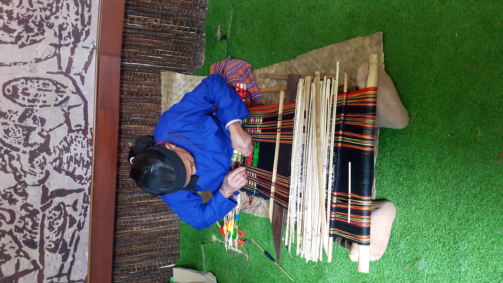

# 黎族传统信仰与祖先—动物灵祈福（Hlai／Li）

<!-- 来源：CC BY-SA 4.0 | https://commons.wikimedia.org/wiki/File:Art_du_tissage_des_Li.jpg -->

## 概述

**黎族（Hlai；汉语亦称黎）** 为中国海南岛主要原住民族群之一，支系多样（哈、杞、润等公开分类）。公开记述：传统宗教偏万物有灵与祖先崇拜；岁时可见 **Sanyuesan（三月三）** 公开文化节、**cattle-soul festival（牛魂／牛日民俗）**、**bamboo-pole dance（竹竿舞）** 与 **household ancestor incense（家屋祖先香火）** 等公开层；雷公、蛇等叙事见于神话；当代并存汉地民间信仰、佛教影响与旅游展演层。本条目为教育概览；**不提供**献牲操作或可冒充祭司的步骤。

## 核心观念（祈福 / 功德 / 祈祷如何被理解）

祈福常被理解为：通过对祖先香火与关键动物灵（牛魂）的敬意，祈求丰收与人畜平安；三月三与竹竿舞承载公开社群欢聚与认同。功德贴近：支持黎语与黎锦等非物质文化遗产的社群主权。访客的「福」体现为：区分村寨礼仪与民俗村表演。

## 典型仪式

### 1. Sanyuesan March 3（公开节庆层）
- **场合**：农历三月三及相关公开文化节。
- **主要步骤（概念层）**：理解 **Sanyuesan（三月三）** 作为公开岁时欢聚、歌舞与认同层。**止于公开文化层**；不以封闭祭仪通关。
- **物品**：节庆服饰外观（从略）。
- **谁来举行**：社群与文化组织；用户仅氛围／观礼，不可主持。

### 2. Cattle-soul festival 与 bamboo-pole dance（公开／概念层）
- **场合**：春季相关牛日／牛魂民俗；节庆舞蹈场合。
- **主要步骤（概念层）**：理解 **cattle-soul festival**（耕牛受敬、停役与护佑叙事）与 **bamboo-pole dance（竹竿舞）** 公开节庆表达。**止于观礼层**。
- **物品**：从略。
- **谁来举行**：农耕家庭、村社与舞者；用户仅观礼。

### 3. Household ancestor incense（家屋概念层）
- **场合**：年节、忌日、日常家屋敬礼。
- **主要步骤（概念层）**：理解 **household ancestor incense**（家屋祖先香火）公开叙述。**禁止**复现内部祭仪细节；用户不可主持。
- **物品**：从略。
- **谁来举行**：家庭；外人／用户仅概念认知。

## 日常与节庆

优先公开民族介绍与海南文化资料；警惕过度旅游化的「黎族婚礼秀」。

## 注意与尊重

**勿把文身遗产写成可消费体验（禁止任何文身操作指导）。** 勿强求献祭演示。家屋香火仅概念。

## 手机互动适合度（Three.js 评估草稿）

- **档位：** B 仅氛围或图文场景
- **敏感度：** 中高
- **判断：** **仅氛围／无用户主持。** Sanyuesan、牛魂／竹竿舞可说明；household ancestor incense 概念层；祭仪不可操作化。
- **若做成互动：** 只做文化地理＋三月三／牛日概念卡。
- **红线：** 禁止献牲、文身操作、冒充祭司。
- **评估状态：** 待后期统一评估

## 参考来源

- https://en.wikipedia.org/wiki/Hlai_people
- https://www.britannica.com/place/Hainan
- https://www.britannica.com/place/Hainan/Cultural-life
