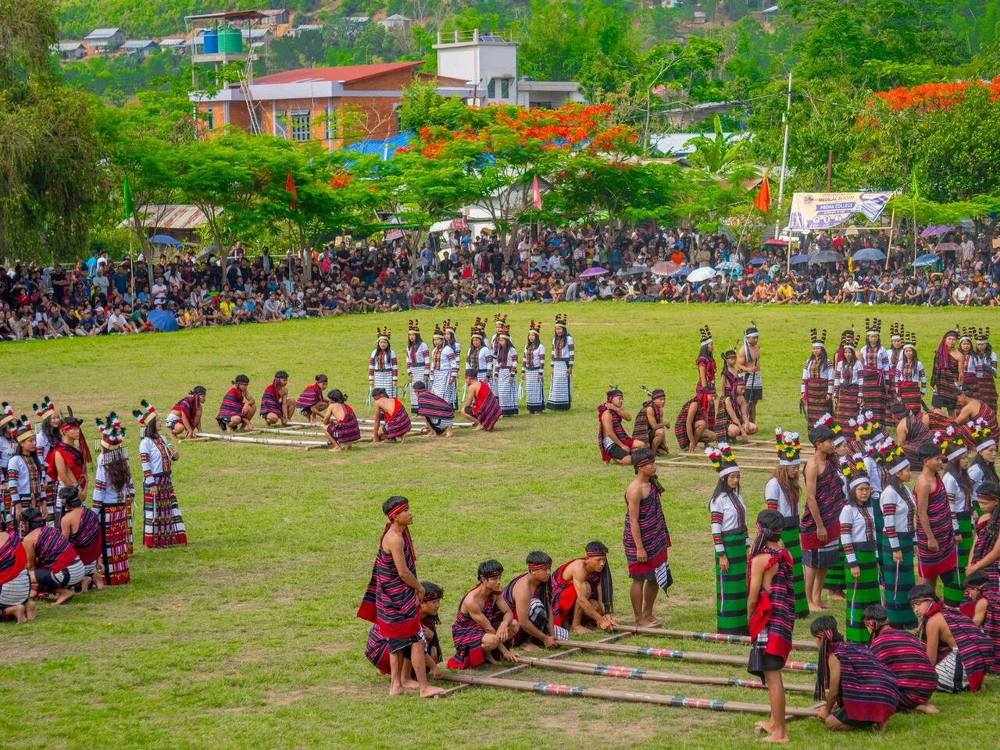

# 赫马尔基督教与佐米传统祈福余绪（Hmar）

<!-- 来源：CC BY-SA 4.0 | https://commons.wikimedia.org/wiki/File:Hmar_Culture_Troupe.jpg -->

## 概述

**赫马尔人（Hmar）** 主要分布于印度曼尼普尔、阿萨姆与米佐拉姆交界山地，属佐米／钦—库基相关社群公开分类。公开记述：今日多数为基督教（长老会等传统常见），**church choir**（堂会唱诗班）主导公共崇拜声音层；传统岁时可见 **Sikpui Ruoi** 收获—和平节公开文化记忆；**traditional song／dance** 作为认同载体与教会生活并存。本条目为教育概览；**不提供**献牲、入会或可冒充祭司的步骤。与派特、米佐、塔多条目可比较。

## 核心观念（祈福 / 功德 / 祈祷如何被理解）

祈福常被理解为：通过主日崇拜、唱诗班赞美、代祷与教会互助，求家庭平安与社群和解；Sikpui Ruoi 承载收获与和平的公开叙事。功德贴近：支持母语教育与边境和平。访客的「福」体现为：不把佐米基督徒写成「失去文化」刻板，也不煽动族群对立。

## 典型仪式

### 1. Sikpui Ruoi harvest peace festival（公开／概念层）
- **场合**：公开记述的收获—和平节文化记忆与当代文化节再现。
- **主要步骤（概念层）**：理解 **Sikpui Ruoi** 作为收获感恩与社群和平叙事的公开层。**止于公开文化层**；禁止复现献牲。
- **物品**：从略。
- **谁来举行**：文化组织与村社；用户仅氛围／观礼，不可主持。

### 2. Church choir（公开教会层）
- **场合**：主日、圣诞、复活节、奋兴会。
- **主要步骤（概念层）**：理解 **church choir** 讲道、唱诗、见证的公开崇拜层。**止于公开教会层**；勿戏仿圣事。
- **物品**：从略。
- **谁来举行**：牧师与会众；用户仅观礼。

### 3. Traditional song／dance（认同／概念层）
- **场合**：文化节、青年聚会、节庆展演。
- **主要步骤（概念层）**：理解 **traditional song／dance** 作为认同与记忆载体。**止于观礼／欣赏**；不以学跳通关。
- **物品**：节庆服饰外观（从略）。
- **谁来举行**：文化团体与青年组织；用户仅观礼。

## 日常与节庆

优先东北印度佐米公开文化层；注意边境政治敏感。生命礼仪（婚丧、命名）以教会祝福与亲族互助为主。

## 注意与尊重

**勿煽动族群／教派对立。** 禁止献牲操作化。摄影须许可。

## 手机互动适合度（Three.js 评估草稿）

- **档位：** B 仅氛围或图文场景
- **敏感度：** 高
- **判断：** **仅氛围／无用户主持。** Sikpui Ruoi、church choir、traditional song／dance 可说明；冲突与祭仪不可游戏化。
- **若做成互动：** 只做信仰变迁说明卡。
- **红线：** 禁止献牲、戏仿圣事、政治煽动。
- **评估状态：** 待后期统一评估

## 参考来源

- https://www.britannica.com/place/Manipur
- https://www.britannica.com/place/Northeast-India
- https://www.britannica.com/topic/Chin-people
