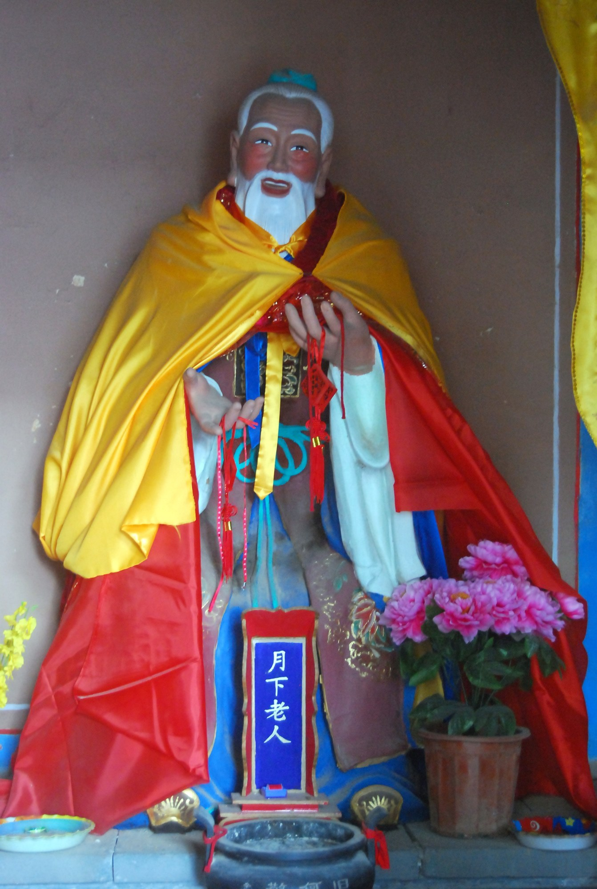

# 红绳／红线（月老赤绳典故与本命年红绳）

<!-- 来源：CC BY-SA 3.0 | https://commons.wikimedia.org/wiki/File:%E6%9C%88%E4%B8%8B%E8%80%81%E4%BA%BA.JPG -->

## 概述

红绳／红线是**汉人民俗中的连结意象，必须分两层叙述**。**A 文学民俗层：** 唐传奇《续玄怪录·定婚店》记月下老人（月老）以赤绳系定夫妇之足——《太平广记》卷一五九「定婚店」条引之（出《续幽怪录》）；《光明日报》文化版梳理「赤绳系足」「红丝结褵」等语汇的文献线索。**B 当代习惯层：** 本命年扎红（红绳手链）与旅游区「许愿红绳」属当代民俗消费与心理习惯，**不可**上溯为单一古代仪轨。红绳**不得**与雅兹迪圣地的结祈愿结（`yazidi.md`，高危敏感传统，严禁混名）、藏传护身线等混名混视觉；「笼统五色绳」的全球合并已在写卡队列中明确跳过。汉人语境的背景可轻量对照 `chinese-folk-and-confucian.md`。

## 核心观念（祈福 / 功德 / 祈祷如何被理解）

A 层的心意是**「看不见的连结」的文学想象**：赤绳系足说的是姻缘早被系定的叙事化理解——它是典故与语汇，**不是一套可执行的仪轨**，也没有可积累的功德。B 层的心意是**趋吉与安己**：本命年系红，取「这一年多一分照看自己」的心理安放；旅游区系绳许愿是随喜的消费层。两层都没有灵验结算，都不承诺姻缘或运势；「系」这个动作表达的是心意相连，不是对命运的强制。

## 典型仪式

### 1. 文学层：月老赤绳系足（概念层）
- **场合**：《续玄怪录·定婚店》叙事；《太平广记》卷一五九引录；后世「赤绳系足」等婚嫁语汇。
- **主要步骤（概念层）**：典故中月下老人以赤绳系于命中夫妻足上——仇敌之家、贵贱悬隔、天涯异乡，此绳一系终不可避。这是叙事母题的转述，不是仪轨步骤；本卡不从典故推导「怎么做」。
- **物品**：赤绳（典故意象）。
- **谁来举行**：故事人物；后世地方庙俗中的月老祈愿属当代庙俗活动层（辅，不作仪轨依据）。

### 2. 当代习惯：本命年扎红与许愿红绳（概念层）
- **场合**：本命年（生肖年）；庙观与旅游区的许愿架。
- **主要步骤（概念层）**：系红绳手链于腕；或将红绳系上枝架并默念心愿。属当代习惯层，做法零散、无统一规制，**不可**叙述为自古如此的古礼。
- **物品**：红绳／红绳手链。
- **谁来举行**：个人；商业场合亦有经营者引导，注意消费边界。

## 日常与节庆

A 层作为语汇与典故存于婚嫁叙述，无节历；B 层的本命年红绳每十二年逢值一年，旅游许愿无固定时令。两层都**不是每日实践**，也无功课要求。月老殿祈愿等地方庙俗属当代庙俗层，本卡不展开其仪轨细节（**待核实**）。

## 注意与尊重

**分层是本卡红线**：文学典故（A）与当代习惯（B）不得混写成一个「古老传统」，UI 与文案必须分标签。禁止与雅兹迪结祈愿结（`yazidi.md`）、藏传护身线混名混视觉；不做五色绳的全球合并。姻缘玩法**不得**强制配对、宿命恐吓（「命中注定必须在一起」一类），不得导向对真实特定之人的纠缠表达；不称开光、加持、灵验。

## 手机互动适合度（Three.js 评估草稿）

- **档位：** C 可做致敬小品（非真仪）
- **敏感度：** 中（婚恋边界、跨传统混并风险）
- **判断：** 「系一个心意结」的手势温暖轻盈；A/B 分层标签让典故与习惯各归其位，是本卡互动能否成立的前提。
- **若做成互动：** 手机手势练习（致敬小品，非民俗实务）：

1. 奶油暖色场景中一根红线，两端各一个小小的光点。
2. 先选标签：**文学典故**（月老赤绳的想象）或**当代习惯**（本命年／许愿红绳），界面各给一句对应说明。
3. 指尖轻拉红线，收拢成一个「心意结」，默念想连结的人、事或家。
4. 界面留一句：心意相连，各自安好。
- **红线：** 不做强制配对、缘分判定或宿命恐吓；不撮合真实用户、不导向对具体之人的执念表达；不与五色绳、雅兹迪结、藏传护身线混名混视觉；分层标签必须展示；不设灵验结算与功德计数。
- **评估状态：** 待后期统一评估

## 参考来源

- https://epaper.gmw.cn/gmrb/html/2021-02/19/nw.D110000gmrb_20210219_2-16.htm
- https://ctext.org/taiping-guangji/159/dinghundian/zhs
