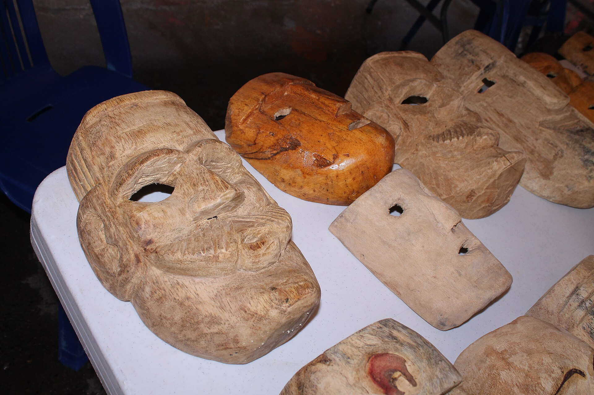

# 瓦斯特克／特内克民间天主教与山灵祈福（Huastec／Teenek）

<!-- 来源：CC BY-SA 4.0 | https://commons.wikimedia.org/wiki/File:Xantolo_85.JPG -->

## 概述

**瓦斯特克人（Huastec；自称 Teenek 等）** 分布于墨西哥东北海湾低地—山地（圣路易斯波托西、韦拉克鲁斯等）。公开概述记述：天主教圣徒与地方灵力、音乐舞蹈传统交织；岁时可见 **Xantolo**（亡灵／万灵相关公开节庆层）、**Voladores de Tamaletón**（塔马莱通飞人，UNESCO 相关公开遗产叙述）、**patron processions**（主保游行）；**mountain／maize CONCEPT**（山灵／玉米农事祈请概念层）。今日并存福音派改宗。本条目为教育概览；**不提供**疗愈脚本、献牲操作或可冒充仪者的步骤。与纳瓦、托托纳克、普雷佩查条目可比较。

## 核心观念（祈福 / 功德 / 祈祷如何被理解）

祈福常被理解为：通过对主保圣人、Xantolo 纪念与地方守护灵的敬意，祈求健康、雨水与家庭平安；玉米—山地伦理承载生计互惠。功德贴近：支持 Teenek 语与土地权利。访客的「福」体现为：在音乐节庆中尊重礼仪段落与舞台段落的区分。

## 典型仪式

### 1. Xantolo 与 patron processions（公开节庆层）
- **场合**：亡灵／万灵相关节期；主保瞻礼。
- **主要步骤（概念层）**：理解 **Xantolo** 与 **patron processions**（弥撒、游行与共食）公开观礼层。**止于公开观礼**；用户不可主持。
- **物品**：从略。
- **谁来举行**：神职与社群；用户仅氛围／观礼。

### 2. Voladores de Tamaletón UNESCO（公开遗产层）
- **场合**：公开展演与遗产相关场合。
- **主要步骤（概念层）**：理解 **Voladores de Tamaletón** 作为 UNESCO 相关公开飞人仪式／舞蹈遗产叙述。**止于观礼／文化遗产说明**；不以学做通关。
- **物品**：从略。
- **谁来举行**：经承认的传承团体；用户仅观礼。

### 3. Mountain／maize CONCEPT（农事／概念层）
- **场合**：农事周期、山地神圣地理公开记述。
- **主要步骤（概念层）**：**Mountain／maize CONCEPT**——理解地方灵与玉米农事祈请的公开概念。**禁止**复现祭仪；用户不可主持。
- **物品**：从略。
- **谁来举行**：家庭与地方权威；外人仅概念认知。

## 日常与节庆

优先海湾低地民族志公开层；注意石油开发区对社会文化的冲击语境。福音派并行社区勿审判。

## 注意与尊重

**勿把传统音乐写成可随意「开光」的商品。** 禁止疗愈旅游。摄影须许可。Mountain／maize 仅 CONCEPT。

## 手机互动适合度（Three.js 评估草稿）

- **档位：** B 仅氛围或图文场景
- **敏感度：** 中高
- **判断：** **仅氛围／无用户主持。** Xantolo、Voladores、patron processions 可说明；mountain／maize CONCEPT；祭仪不可操作化。
- **若做成互动：** 只做地理＋主保节／飞人遗产说明。
- **红线：** 禁止献牲、疗愈脚本、冒充仪者。
- **评估状态：** 待后期统一评估

## 参考来源

- https://www.britannica.com/topic/Huastec
- https://www.britannica.com/place/San-Luis-Potosi-state-Mexico
- https://www.britannica.com/place/Mexico
