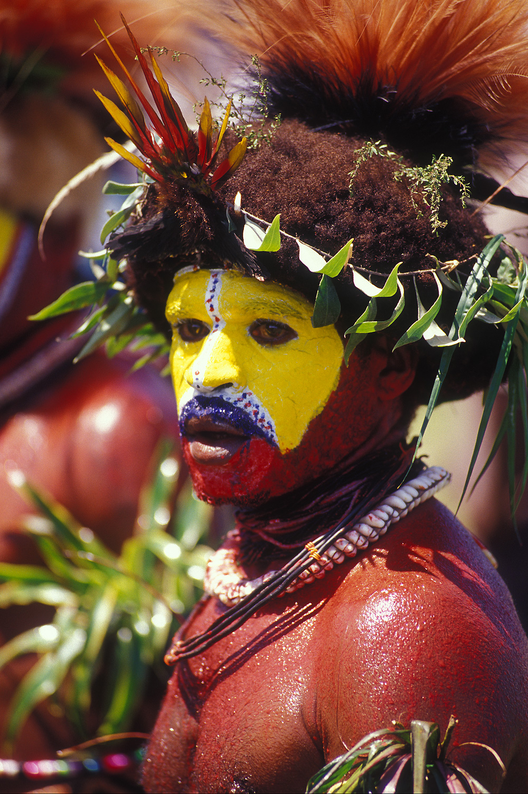

# 胡里传统信仰与高地礼仪祈福概观（Huli）

<!-- 来源：CC BY 2.1 au | https://commons.wikimedia.org/wiki/File:Huli_wigman.jpg -->

## 概述

**胡里人（Huli）** 分布于巴布亚新几内亚南部高地，以精美头饰、园艺与复杂礼仪生活闻名。公开民族志记述：传统宇宙强调丰饶、祖先与地方灵；大型礼仪与赔偿／和解机制维系社会；今日基督教广泛传播并与传统并行。本条目**仅作高度克制概览**；**不提供**战争、入会、献牲或任何可冒充仪者的步骤。

## 核心观念（祈福 / 功德 / 祈祷如何被理解）

祈福常被理解为：通过对祖先与丰饶相关灵力的正确关系，以及赔偿正义，恢复群体力量。功德贴近：支持高地社群对采矿与旅游的解释权，反对「野蛮头饰」刻板。访客的「福」体现为：不去购买战争秀式旅游。

## 典型仪式

### 1. 丰饶与农事礼仪（概念层）
- **场合**：园艺周期公开记述。
- **主要步骤（概念层）**：理解丰饶祈请的公开叙述。**禁止**复现祭仪。
- **物品**：从略。
- **谁来举行**：家庭与礼仪权威。

### 2. 赔偿—和解公共机制（概念层）
- **场合**：冲突后公开调解。
- **主要步骤（概念层）**：理解物质与象征赔偿恢复和平。**止于概念**。
- **物品**：从略。
- **谁来举行**：长老与当事亲属。

### 3. 基督教并行（概念层）
- **场合**：堂会与传统并行。
- **主要步骤（概念层）**：理解改宗与文化持续。**勿审判**。
- **物品**：从略。
- **谁来举行**：教牧与信众。

## 日常与节庆

优先严肃民族志；警惕综艺式「部落秀」。并与达尼、恩加等东新几内亚高地条目区分。

## 注意与尊重

**严禁战争／入会内容操作化。** 摄影须许可。把尊严放在流量之前。

## 手机互动适合度（Three.js 评估草稿）

- **档位：** A 不建议做成操作型互动
- **敏感度：** 极高
- **判断：** 高地雷利与战争相关礼仪不宜游戏化。
- **若做成互动：** 不建议；最多静态地理与园艺文化说明。
- **红线：** 禁止入会、战争、献牲、冒充仪者。
- **评估状态：** 待后期统一评估

## 参考来源

- https://www.britannica.com/topic/Huli
- https://www.britannica.com/place/Papua-New-Guinea
- https://www.britannica.com/place/New-Guinea
