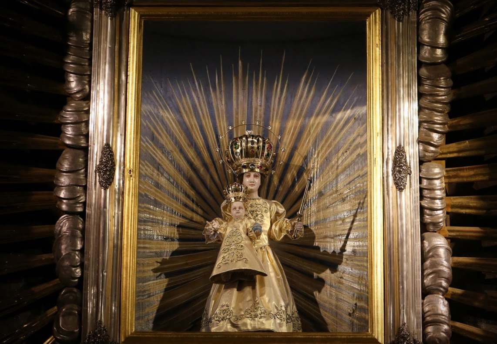

# 匈牙利民间天主教与朝圣祈福（Hungarian Folk／Magyar népi vallásosság）

<!-- 来源：CC BY-SA 4.0 | https://commons.wikimedia.org/wiki/File:MatraverebelySzentkutFotoThalerTamas20.jpg -->

## 概述

**匈牙利（Magyarország）** 民间祈福传统以拉丁礼天主教为主干，并与更早的圣王崇拜、圣母显现圣地与村落岁时习俗交织；大英百科概述匈牙利历史上为天主教国家，同时新教与世俗人口亦具分量。公开朝圣文化中，**Mátraverebély-Szentkút** 被枢机主教宣布为全国朝圣地（Nemzeti Kegyhely），方济各会管理，传说与圣拉迪斯劳斯（Szent László）跃马出泉及圣母显现治愈哑童相连，每年约有大批朝圣者前来；圣母升天前后为重要朝圣季。跨境／区域圣母朝圣网络中，**Csíksomlyó（奇克绍姆约）** 圣母朝圣亦为重要命名参考。**8 月 20 日圣伊什特万（Szent István／圣斯蒂芬）国庆** 与「新粮／新面包祝福」公共记忆相连。学术论述亦梳理圣伊什特万在民间叙事与节庆中的持续影响。本条目聚焦可核验的民间天主教／朝圣层，与泛斯拉夫或凯尔特条目区分；**不提供**告解脚本、圣水“配方”、驱魔步骤或任何可冒充圣事的操作。

## 核心观念（祈福 / 功德 / 祈祷如何被理解）

祈福常被理解为：在圣母转求、圣王护国与地方圣泉／圣像的恩宠叙事中，通过朝圣步行、参与弥撒与告解、还愿与守节，使疾病得慰、家庭和好、民族与邻里和平得蒙祝福。功德贴近：完成许愿的朝圣、支持朝圣接待与慈善、在圣诞／复活／圣母节期维持家庭祈祷与歌唱传统。访客的「福」体现为：把中欧天主教民间虔诚看作仍活着的公共宗教文化，而非“异教残留表演”。

## 典型仪式

### 1. Szentkút 全国朝圣地巡礼（公开朝圣层）
- **场合**：诺格拉德／切尔哈特山麓的 Mátraverebély-**Szentkút**；圣母升天前后主日及全年团体朝圣。
- **主要步骤（概念层）**：步行朝圣团体抵达、参与弥撒与圣事、朝圣泉／圣所祈祷与还愿。官方叙述强调复原与和好。**止于公开朝圣观礼层**；不提供可复现的“灵修课程”或冒充司铎的环节。保留 Szentkút 作为核心圣地命名。
- **物品**：圣殿外观、朝圣泉、还愿物外观。
- **谁来举行**：方济各会与朝圣团；教友参与，游客遵守礼仪安静观礼。

### 2. Csíksomlyó 圣母朝圣与圣王—新粮节庆（历史文化／公共层）
- **场合**：**Csíksomlyó** 圣母朝圣；**8 月 20 日**圣伊什特万纪念日与国家—民间节庆；地方游行与博物馆／学术叙述。
- **主要步骤（概念层）**：理解跨境／区域 **Csíksomlyó Marian pilgrimage** 命名；理解开国圣王在民间传说、法律记忆与天主教节日中的象征，以及 **新面包／新粮祝福** 的公共节庆记忆。具体堂区游行从略。**不是**重建萨满式“前基督教魔法”。
- **物品**：圣像、王冠象征、节日面包／服饰外观。
- **谁来举行**：教会、地方政府与文化团体。

### 3. 堂区岁时与家庭还愿（日常民间层）
- **场合**：将临期／圣诞、四旬期／复活、圣母月与地方主保日；家庭还愿旅行。
- **主要步骤（概念层）**：弥撒、念珠、点烛与许愿／还愿。**禁止**把圣事写成游戏关卡。
- **物品**：蜡烛、圣牌、玫瑰经外观。
- **谁来举行**：司铎、修道者与家庭；平信徒按堂区指引。

## 日常与节庆

教会年历、全国朝圣季、Csíksomlyó 相关朝圣季与地方主保日构成公开节奏。优先朝圣地官方史述、Britannica 国家宗教概述与可核验的圣王民间传统研究。

## 注意与尊重

**弥撒中勿随意摄影或走动。** 勿把圣泉当作“魔法许愿池”戏耍。区分学术上的前基督教马扎尔信仰残余讨论与当代民间天主教实践。跨境（如斯洛伐克裔、特兰西瓦尼亚匈牙利裔）朝圣团体的语言与民族情感须尊重。

## 手机互动适合度（Three.js 评估草稿）

- **档位：** C 可做致敬小品（非真仪）
- **敏感度：** 低
- **判断：** 公开朝圣步道、山林圣殿外观与节庆灯火以风景与民事虔诚为主，适合非圣事操作的致敬小品；真弥撒、告解与敷油不可写成通关。取 C：手势练习向民间朝圣文化致敬。
- **若做成互动：** 手势练习——（1）拖动虚拟朝圣者沿林径走向圣殿轮廓；（2）陀螺仪平稳“鞠躬”点亮还愿小灯（非真弥撒）；（3）在说明卡上写下对和平与家庭的一句致敬；（4）旋转查看圣殿—山丘风景卡。均标注为手势练习，不以真朝圣圣事或圣泉治愈作通关。
- **红线：** 禁止模拟成圣体、告解、驱魔，或以真圣事／真神迹宣称为胜负。
- **评估状态：** 待后期统一评估

## 参考来源

- https://szentkut.hu/en/history-of-the-shrine
- https://szentkut.hu/en
- https://real.mtak.hu/157720/1/MKI_kingsandsaints_B5_012.pdf
- https://szentkut.hu/bucsurend-2026
- https://ich.unesco.org/en/Decisions/11.COM/10.b.25
- https://szentkut.hu/en/contact-information
