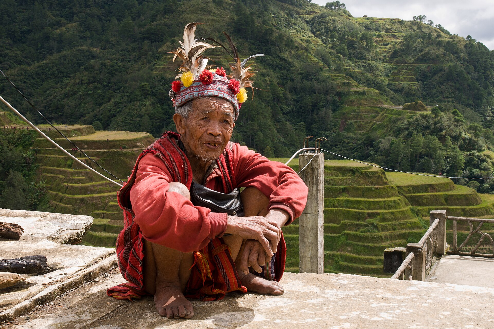

# 伊富高稻作—祖灵祈福传统（Ifugao）

<!-- 来源：CC BY-SA 3.0 | https://commons.wikimedia.org/wiki/File:Banaue_Philippines_Ifugao-Tribesman-01.jpg -->

## 概述

**伊富高人（Ifugao）** 是菲律宾吕宋岛北部科迪勒拉山区的湿稻耕作民族，语言属南岛语系。其以石砌梯田闻名于世；**Hudhud** 史诗吟唱已被联合国教科文组织列入人类非物质文化遗产代表作名录；**Punnuk**（收获后跨河拔河祝福，UNESCO 相关公开叙述）为社群公开祝福／闭合农季层；**Bulul** 是置于谷仓的祖先—稻谷守护雕像；礼仪专家 **Mumbaki** 属 **viewing-only**（仅观礼）。科迪勒拉稻作梯田亦为世界遗产文化景观。本条目为教育概览；**不提供** mumbaki 祝圣脚本、献牲剂量、附体操作或任何可冒充祭司的步骤。

## 核心观念（祈福 / 功德 / 祈祷如何被理解）

祈福常被理解为：在梯田水利、氏族互助与祖灵—稻神秩序中，通过 Hudhud 吟唱、Punnuk 公开祝福、尊重 bulul 与圣地，使米谷与家庭平安得蒙护持。功德贴近：参与互助劳作、传承 Hudhud、维护梯田与谷仓伦理。访客的「福」体现为：把伊富高宇宙观看成仍活着的山地农耕智慧与口述遗产，而非“可购买的稻神雕像表演”；Mumbaki viewing-only。

## 典型仪式

### 1. Hudhud UNESCO 与 Punnuk UNESCO tug-of-war blessing（公共文化遗产层）
- **场合**：播种、收获、守夜；收获后跨河拔河祝福公开记述。
- **主要步骤（概念层）**：理解 **Hudhud UNESCO** 吟唱（主诵与歌队交替）与 **Punnuk UNESCO tug-of-war blessing** 作为公开社群祝福／农季闭合层。**止于公开文化遗产层**；不复原祭词或请神程序。
- **物品**：口头传统、梯田、河流与村落集会空间外观。
- **谁来举行**：掌握传统的吟唱者与社群；游客仅可在获邀或公共展演时远观——用户不主持。

### 2. Bulul 谷仓守护（概念层）
- **场合**：求丰收、护粮、与稻作相关的家庭／氏族仪礼；雕像置于谷仓。
- **主要步骤（概念层）**：公开博物馆与遗产叙述说明 **Bulul** 须经社群承认的仪轨才具守护地位。**止于概念**；禁止描写献血、附体或可仿作祝圣。
- **物品**：木雕外观、谷仓（远观）；真仪细节从略。
- **谁来举行**：mumbaki 与相关家族；外人不得僭越。

### 3. Mumbaki viewing-only（高度敏感，仅观礼）
- **场合**：疾病、纠纷或重大困境；以宴请与米酒召请神灵／祖先。
- **主要步骤（概念层）**：**Mumbaki viewing-only**——理解公开民族志所述的“召请—宴请”互惠逻辑。**不提供**神名清单操作、酒祭步骤或祭司口授；用户不可主持。
- **物品**：从略。
- **谁来举行**：经承认的礼仪专家与亲属；禁止游客扮演。

## 日常与节庆

梯田农时、互助修渠、Hudhud 传承工作坊、Punnuk 公开祝福与地方文化节构成公开节奏。优先 Britannica、UNESCO（Hudhud／Punnuk／Cordilleras 梯田）、菲律宾国家博物馆与大学遗产项目公开叙述。

## 注意与尊重

**勿擅自进入正在举行仪礼的家屋／谷仓核心区或触摸 bulul。** 勿把旅游工艺品等同于已祝圣的 bulul。区分 Hudhud／Punnuk 公共层与 mumbaki 限制性知识。摄影与录音须经社群同意。

## 手机互动适合度（Three.js 评估草稿）

- **档位：** B 仅氛围或图文场景
- **敏感度：** 中
- **判断：** **仅氛围／无用户主持。** Hudhud UNESCO；Punnuk UNESCO tug-of-war blessing；Bulul 可说明；Mumbaki viewing-only；祝圣／献牲／附体不宜做成可操作关卡。
- **若做成互动：** 只做可旋转／可走近的梯田—村落风景与说明卡；不提供祝圣、献牲或通灵操作。
- **红线：** 禁止模拟 mumbaki 请神、雕像献血祝圣、附体或以真仪名称作通关。
- **评估状态：** 待后期统一评估

## 参考来源

- https://www.britannica.com/topic/Ifugao-people
- https://ich.unesco.org/en/RL/hudhud-chants-of-the-ifugao-00015
- https://whc.unesco.org/en/list/722/
- https://www.nationalmuseum.gov.ph/2022/11/30/bulul-and-the-socio-cultural-significance-of-rice/
- https://ncca.gov.ph/about-culture-and-arts/in-focus/ifugao-hudhud-local-to-global-dimension-of-the-sacred/
