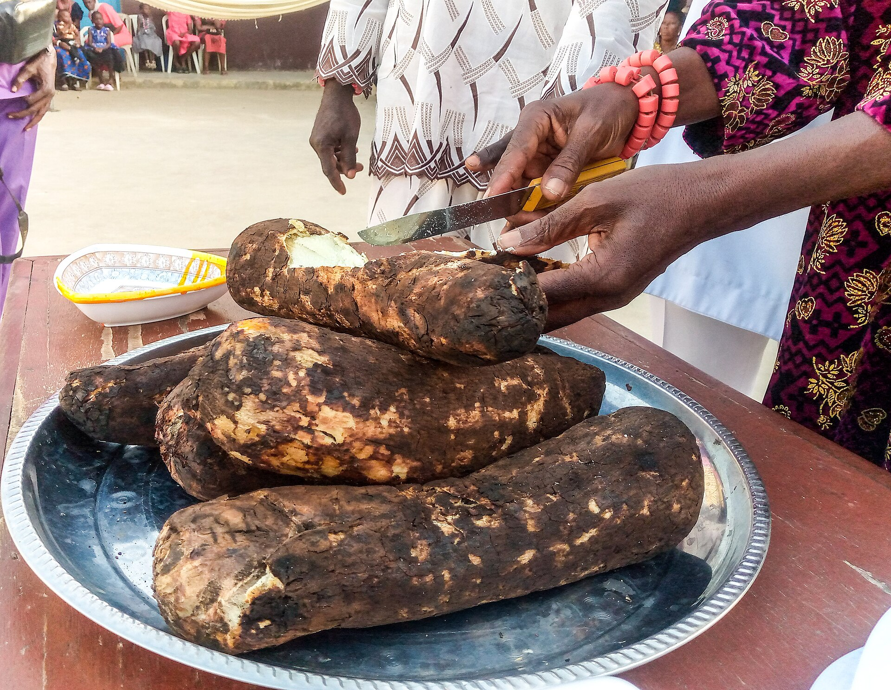

# 伊博传统宗教（Igbo / Odinani）

<!-- 来源：CC BY-SA 4.0 | https://commons.wikimedia.org/wiki/File:Yam_Eating_Festival_in_an_Igbo_Community,_Nigeria.jpg -->

## 概述

伊博人（Igbo，亦作 Ibo）主要居住于今日尼日利亚东南部，传统上以村社或村群为政治单元。传统宗教常称 **Odinani**／**Omenala**，核心是至高创造者 **Chukwu**／**Chineke**、大地女神 **Ala**／**Ani**、个人成就象征 **Ikenga**、各类神灵（*alusi*）以及护佑后裔的祖先。公开岁时以 **Iri Ji**（新薯节）为重要公共感恩层；**Dibia CONCEPT ONLY**（占卜／疗愈专家仅概念）；**morning libation CONCEPT high-level**（晨奠酒仅高层次概念）。19 世纪中叶以降基督教迅速传播，今日多数伊博人为基督徒，但仍可见与本土观念交织的实践。本条目为教育性概览；不对神谕裁断、秘社仪轨或献祭操作提供可复现说明。

## 核心观念（祈福 / 功德 / 祈祷如何被理解）

Chukwu 被理解为创造并维系世界的至高者；具体护佑多经神灵与祖先传递。个人命运与守护灵 **chi** 相关；**Ala** 大地女神守护道德与土地；**Ikenga** 象征个人成就与右手力量的公开概念。功德表现为对祖先奠酒与供养、诚实履行村社价值、完成人生礼仪，以及在 **Iri Ji** 庆典中先敬神灵祖先再分享收获。访客的「福」体现为：尊重公共节庆与概念层边界；Dibia CONCEPT ONLY。

## 典型仪式

### 1. Iri Ji（新薯节，公开社群层）
- **场合**：雨季末、约公历八月前后，各地日期不一；标志旧作结束与收获开端。
- **主要步骤（概念层）**：社区在长者或传统权威主持下，先将新薯奉献给神灵与祖先并感恩至高者护佑，然后才允许村民食用新薯；伴有集会、乐舞与社交。**止于公开文化层**；用户不主持。
- **物品**：新收获的薯类、祭坛／公共广场、节庆服饰与鼓乐外观。
- **谁来举行**：村社长者、传统统治者与全体社区；用户仅氛围／观礼。

### 2. Ikenga 与 Ala earth goddess（概念层）
- **场合**：个人成就叙事、土地伦理、道德教导公开记述。
- **主要步骤（概念层）**：理解 **Ikenga** 作为个人成就／守护象征，以及 **Ala earth goddess** 作为大地道德与土地护佑的公开概念。**止于概念**；禁止复现神龛操作。
- **物品**：从略。
- **谁来举行**：家庭与社群权威语境；用户不可主持。

### 3. Dibia CONCEPT ONLY 与 morning libation CONCEPT high-level（高度敏感／高层次概念）
- **场合**：求保护、感恩、祛除不幸；每日清晨或议事／远行节点。
- **主要步骤（概念层）**：**Dibia CONCEPT ONLY**——知晓占卜／疗愈专家存在，**不提供**问询脚本；**morning libation CONCEPT high-level**——理解家父可代表全家向 Chukwu 晨祷、饮用棕榈酒前向祖先倾洒以致敬的高层次意图叙述。**禁止**牲礼切割或可复现步骤；用户不可主持。
- **物品**：从略。
- **谁来举行**：家族长者与被承认的 dibia；外人／用户仅概念认知。

## 日常与节庆

农耕节律（尤其是薯类）与宗教日历交织；市集日名称本身对应四日周期中的神灵。城市与海外伊博社群中，Iri Ji 与命名礼等常以文化节日形式延续。

## 注意与尊重

秘社、神谕裁断与某些成人礼属限制性知识，勿强求参观或拍摄。Dibia CONCEPT ONLY；morning libation 仅高层次概念。关于双生子禁忌等历史习俗，应以批判与变迁视角表述。人祭与奴隶贸易时期神谕操纵属于创伤历史，本档案不做细节复原。

## 手机互动适合度（Three.js 评估草稿）

- **档位：** B 仅氛围或图文场景
- **敏感度：** 高
- **判断：** **仅氛围／无用户主持。** Iri Ji；Ikenga；Ala earth goddess 可说明；Dibia CONCEPT ONLY；morning libation CONCEPT high-level；不宜用户主持献祭通关。
- **若做成互动：** 可不做操作关卡，只做可旋转/可走近的场景与说明卡。
- **红线：** 禁止牲礼切割、秘社／神谕裁断复现或人祭史猎奇操作化。
- **评估状态：** 待后期统一评估

## 参考来源

- https://www.britannica.com/topic/Igbo
- https://www.encyclopedia.com/environment/encyclopedias-almanacs-transcripts-and-maps/igbo-religion
- https://www.britannica.com/topic/African-religions
