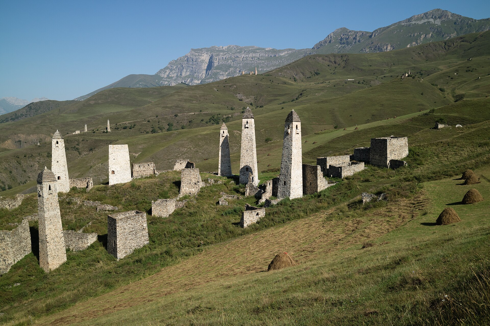

# 印古什民间伊斯兰与高加索塔楼祈福（Ingush）

<!-- 来源：CC BY 4.0 | https://commons.wikimedia.org/wiki/File:Erzi,_Ingushetia,_Erzi_tower_complex,_panoramic_view.jpg -->

## 概述

**印古什人（Ingush）** 为北高加索瓦伊纳赫语族民族，与车臣人近缘，主要分布于俄罗斯印古什共和国。公开概述记述：绝大多数为逊尼派穆斯林，苏菲传统在历史上影响深远；**Tkhaba-Erdy** 圣地／教堂遗址朝谒公开层、**Egikal／Erzi** 石砌塔楼景观、**Ezdanga** 好客伦理，以及 **Sufi Zikr viewing-only**（苏菲齐克尔仅观礼）构成文化—宗教公开叙述；驱逐与冲突创伤深刻影响集体纪念。本条目为教育概览；**不提供**教团秘仪或政治动员话术。与车臣瓦伊纳赫、阿瓦尔条目可比较。

## 核心观念（祈福 / 功德 / 祈祷如何被理解）

祈福常被理解为：通过礼拜、斋戒、施舍、对 Tkhaba-Erdy 等圣地的敬意与 Ezdanga 好客，求家庭平安与正义得申。功德贴近：支持语言，诚实纪念驱逐与战争创伤。访客的「福」体现为：旅行低调，不在纪念场合自拍；Zikr viewing-only。

## 典型仪式

### 1. Tkhaba-Erdy shrine（公开圣地／概念层）
- **场合**：纪念日、文化朝谒、还愿公开记述。
- **主要步骤（概念层）**：理解 **Tkhaba-Erdy** 作为印古什重要圣地／历史教堂遗址的公开朝谒层。**止于概念／远观**；禁止编造介祷配方。
- **物品**：从略。
- **谁来举行**：家族与地方权威；用户仅氛围／观礼，不可主持。

### 2. Egikal／Erzi towers 与 Ezdanga hospitality（遗产／伦理层）
- **场合**：文化日、口述、访客接待、悼念。
- **主要步骤（概念层）**：理解 **Egikal／Erzi** 塔楼作为荣誉与历史记忆象征，以及 **Ezdanga** 好客伦理。**勿消费创伤**；止于公开伦理／遗产说明。
- **物品**：从略。
- **谁来举行**：社群与家庭；用户为受礼客人，不主持。

### 3. Sufi Zikr viewing-only（敏感，仅观礼）
- **场合**：苏菲聚会、纪念日公开记述。
- **主要步骤（概念层）**：**Sufi Zikr viewing-only**——理解齐克尔作为记主实践的公开存在。**禁止**复现教团仪轨或编造秘仪；用户仅观礼或回避。
- **物品**：从略。
- **谁来举行**：教团与地方权威；外人／用户仅观礼。

## 日常与节庆

清真寺礼拜与伊斯兰节日（主麻、开斋、宰牲节）为常识公开层。优先 Britannica；注意安全与政治敏感。

## 注意与尊重

**勿把高加索穆斯林议题政治化。** Zikr viewing-only。禁拍未同意对象。禁止政治煽动。

## 手机互动适合度（Three.js 评估草稿）

- **档位：** B 仅氛围或图文场景
- **敏感度：** 高
- **判断：** **仅氛围／无用户主持。** Tkhaba-Erdy、Egikal／Erzi、Ezdanga 可说明；Sufi Zikr viewing-only；教团仪轨与创伤不可游戏化。
- **若做成互动：** 只做建筑遗产说明。
- **红线：** 禁止礼拜通关、消费驱逐创伤、政治动员、冒充齐克尔主持。
- **评估状态：** 待后期统一评估

## 参考来源

- https://www.britannica.com/topic/Ingush
- https://www.britannica.com/place/Ingushetiya
- https://www.britannica.com/topic/Sufism
