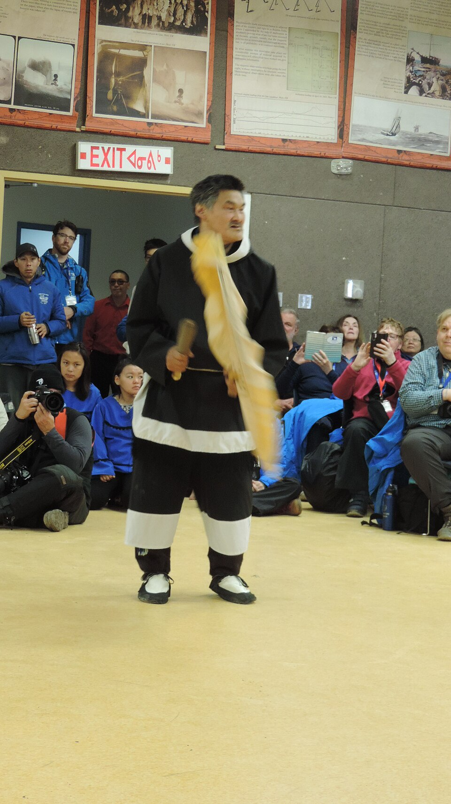

# 因纽特（Inuit）

<!-- 来源：CC BY 4.0 | https://commons.wikimedia.org/wiki/File:Inuit_drum_dance_at_the_community_centre,_Gjoa_Haven,_September_2019.jpg -->

## 概述

因纽特人分布于北美北极与亚北极（今日加拿大北部、格陵兰、阿拉斯加部分地区等），传统生计依赖海兽、驯鹿与季节性迁徙。宗教观以万物有灵为核心：人、动物、器物皆可具有灵魂或精气；狩猎成功与社区健康，取决于对禁忌的遵守及与动物母神等超自然力量的互惠关系。礼仪专家常称 *angakok*／*angakkuq*（复数 *angákut* 等，方言有异），主要职能是疗愈、协助狩猎，并在危机时以入神方式与灵界沟通。大英百科全书与博物馆资料均强调：疾病常被理解为破禁或灵魂被摄；集体坦白与萨满的“灵魂寻回”是公开叙述中的关键应答。本条目为教育概览，**不提供**入神、启蒙或秘传操作细节。

## 核心观念（祈福 / 功德 / 祈祷如何被理解）

祈福首先是**维持与猎物世界的正当关系**。对刚猎获的动物表达礼貌与送还灵魂的姿态，被认为有助于同类动物再生；破禁则会激怒掌管海兽的母神（常称 Sedna，亦有 Nuliajuk、Talilayuk 等名），导致猎物消失、饥荒威胁社区。祈祷与“功德”因此更接近**纠正失序、恢复互惠**：社区成员公开承认过失，萨满代为求情或安抚母神，使海豹、鲸、海象等重返猎人世界。个人亦可佩戴护符、在梦中获得力量之歌；但重大危机仍交由被承认的 *angakok* 处理。当代许多因纽特社区已深度基督教化，传统知识常以故事、艺术与长老口述延续，而非完整旧式萨满制度的复制。

## 典型仪式

### 1. 安抚海兽之母（Sedna／Nuliajuk 概念层）
- **场合**：猎物长期匮乏、社区面临饥荒风险时。
- **主要步骤（概念层）**：*angakok* 以入神方式“下行”至海底母神居所，代社区致歉并请求释放海兽；归来后常伴随集体坦白与庆祝。公开描述止于目的与宇宙观意义。
- **物品**：鼓等礼仪用具（地区差异大）。
- **谁来举行**：被社区承认的萨满；全体成员参与坦白与后续共享。

### 2. 疗愈与灵魂寻回
- **场合**：疾病、失魂、疑似巫术或破禁所致的危机。
- **主要步骤**：透过集体坦白驱除不洁；或萨满象征性前往灵界寻回患者灵魂。不描述入神技术与秘传语言。
- **物品**：鼓、护符等。
- **谁来举行**：*angakok* 与患者亲属／社区。

### 3. 狩猎前后的禁忌与礼貌对待猎物
- **场合**：日常渔猎、季节转换。
- **主要步骤**：遵守地方禁忌；对新鲜猎获表达尊重，以促进动物灵魂再生。属日常伦理实践，而非单一节庆脚本。
- **物品**：因猎种与地方而异。
- **谁来举行**：猎人、家庭与长老教导下的年轻人。

## 日常与节庆

命名习俗中，逝者之名可赋予新生儿，体现灵魂延续观。护符、力量之歌与梦兆曾是普通人也可接触灵界的途径。今日因纽特艺术（如开普多塞特版画）常以 Sedna 与萨满意象承载文化记忆；博物馆与学校成为重要传承场域。基督教礼拜与传统故事并行，是许多社区的现实，而非简单“取代”。

## 注意与尊重

萨满启蒙与入神仪轨属高度内部知识，本档案绝不复现操作步骤。勿把“北极萨满体验”商品化，或擅自使用因纽特神圣意象做娱乐。研究与旅游应优先尊重原住民主权、语言与知情同意。使用“Eskimo”一词在部分地区被视为冒犯，宜采用社区自用的自称（如 Inuit）。

## 手机互动适合度（Three.js 评估草稿）

- **档位：** A 不可做成关卡
- **敏感度：** 高
- **判断：** 安抚海兽之母与灵魂寻回由 angakok 入神下行；启蒙与入神仪轨属高度内部知识。禁止商品化北极萨满体验。
- **若做成互动：** 不提供操作步骤。
- **红线：** 不模拟入神下行、寻魂技术或以 Sedna 仪礼通关。
- **评估状态：** 待后期统一评估

## 参考来源

- https://www.britannica.com/topic/angakok
- https://www.britannica.com/topic/shamanism/Shamans-outside-of-northern-Asia
- https://www.britannica.com/place/Arctic/Seasonally-migratory-peoples-the-northern-Yupiit-and-the-Inuit
- https://www.britannica.com/topic/Inuit-people
- https://www.historymuseum.ca/capedorsetprints/themes/myths.php
- https://www.spri.cam.ac.uk/museum/news/collections/2019/03/28/the-mother-of-the-sea-creatures/
