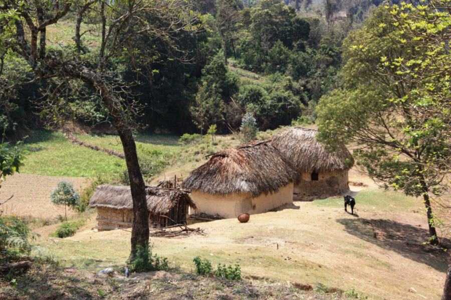

# 伊拉克伍传统信仰与库希特祈福（Iraqw）

<!-- 来源：CC BY-SA 4.0 | https://commons.wikimedia.org/wiki/File:Manyara_Iraqw_nyumba_shambani_2012_Tamino.jpg -->

## 概述

**伊拉克伍人（Iraqw）** 分布于坦桑尼亚北中部（曼亚拉／阿鲁沙一带公开地名），语言属南库希特，与周围班图社群显著不同。公开概述记述：传统宇宙含祖先与地方灵力、农牧复合生计；求雨与净化相关公开叙述可见 **Loo** 雨／净化观礼层；雨事专家 **Qwaslare** 与水灵 **Netlangw** 属 **CONCEPT ONLY**——**users don't officiate**。今日并存基督教与本土实践。本条目为教育概览；**不提供**献牲、疗愈脚本、求雨操作或可冒充仪者的步骤。

## 核心观念（祈福 / 功德 / 祈祷如何被理解）

祈福常被理解为：通过对祖先、土地伦理与水／雨灵力的正确关系，并／或通过教堂祈祷，求雨水、畜群与家庭平安。功德贴近：支持伊拉克伍语与抗旱农业。访客的「福」体现为：把 **Loo** 当作观礼／氛围理解，不把 **Qwaslare**／**Netlangw** 写成可扮演技能；**users don't officiate**。

## 典型仪式

### 1. Loo 雨／净化观礼（viewing-only）
- **场合**：旱季求雨、净化相关公开记述。
- **主要步骤（概念层）**：理解 **Loo** 作为雨／净化公开叙事。**viewing-only**；**禁止**复现求雨／净化操作。
- **物品**：从略。
- **谁来举行**：长老与承认的权威；访客仅观礼——**users don't officiate**。

### 2. Qwaslare 雨事专家（CONCEPT ONLY）
- **场合**：社群雨事与农牧危机公开叙述。
- **主要步骤（概念层）**：知晓存在雨事专家职分。**CONCEPT ONLY**；禁止提供呼风、祭词或「成为 Qwaslare」教程。
- **物品**：从略。
- **谁来举行**：被承认的 Qwaslare；用户不可主持。

### 3. Netlangw 水灵（CONCEPT）
- **场合**：水／泉／雨相关伦理与神话公开层。
- **主要步骤（概念层）**：理解 **Netlangw** 水灵概念。**CONCEPT**；禁止操作化「召唤水灵」。
- **物品**：从略。
- **谁来举行**：传统权威；**users don't officiate**。

## 日常与节庆

优先北中坦桑尼亚公开文化层；强调库希特认同与教堂并存。

## 注意与尊重

**勿强求仪者演示求雨。** 禁止献牲旅游。摄影须许可。**Users don't officiate.**

## 手机互动适合度（Three.js 评估草稿）

- **档位：** B 仅氛围或图文场景
- **敏感度：** 高
- **判断：** **仅氛围／无用户主持。** Loo rain/purification viewing-only；Qwaslare CONCEPT ONLY；Netlangw CONCEPT；祭仪不可操作化。
- **若做成互动：** 只做语言谱系＋地理／雨季说明卡。
- **红线：** 禁止献牲、求雨脚本、疗愈、冒充 Qwaslare。
- **评估状态：** 待后期统一评估

## 参考来源

- https://www.britannica.com/topic/Iraqw
- https://www.britannica.com/place/Tanzania
- https://www.britannica.com/topic/Cushitic-languages
