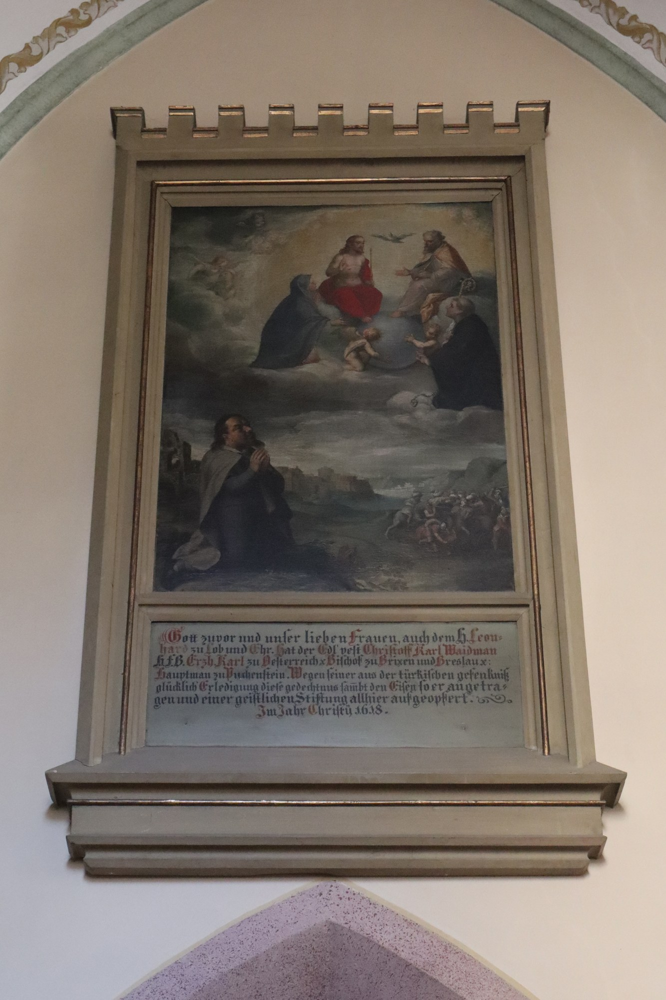

# 意大利绘牌还愿（ex-voto / tavoletta votiva）

<!-- 来源：CC BY-SA 4.0 | https://commons.wikimedia.org/wiki/File:Merano,_chiesa_di_San_Leonardo_-_Dipinto_ex_voto.jpg -->

## 概述

意大利绘牌还愿（*ex-voto*，绘牌称 *tavoletta votiva*）是**天主教民间还愿的绘画形式（A）**：灾病、危难得脱之后，请工匠绘「危难场景＋呼求代祷＋平安结局」图式的小画板，题铭（常作 **P.G.R.**，*Per Grazia Ricevuta*，「为所蒙受之恩」）并献挂于圣母或圣人圣地，是**谢恩的公开化**多于纯许愿（Science Museum Group 藏 **1724 年 Deruta 锡釉陶牌**为例证）。它与墨西哥金属还愿符 milagros（`milagros.md`）、新西班牙绘板 ex-voto／retablo（美国国家医学图书馆展览页——对照传统而非同一物件）、天主教还愿烛同属「还愿可见记号」的大家族而**物件各异**，产品须**分文化分皮肤**；天主教整体语境见 `christianity.md`。

## 核心观念（祈福 / 功德 / 祈祷如何被理解）

绘牌的逻辑是**事后谢恩的见证**：不是先付代价买奇迹，而是在得脱之后，把「那一刻的危难、那一声呼求、如今的平安」画下来，写上 P.G.R.，挂上圣地墙，让私人的感恩变成公开可见的记号。不断累积的绘牌墙于是成为集体的感恩档案。绘牌本身没有功效保证、没有功德计量；它的意义在见证与感谢，不在交易。「蒙恩」的叙述权属于还愿者本人，产品不得替用户「制造神迹」。

## 典型仪式

### 1. 危难得脱后献绘牌（概念层）
- **场合**：灾病、事故、危难得脱之后；圣母或圣人朝圣地的还愿墙。
- **主要步骤（概念层）**：得脱者常请工匠代笔，依「危难—呼求—平安」图式绘小画板；题铭文与年份（常作 P.G.R.）；献挂于圣地墙面，公开谢恩。实地须遵守圣地方向与悬挂规范。
- **物品**：锡釉陶／木质小画板（tavoletta votiva）。
- **谁来举行**：民间信众个人或家庭；绘制多出工匠之手；无圣职人员要求。

## 日常与节庆

绘牌还愿**不按节历、按际遇**：危难得脱是它的触发点，与朝圣节期相连但不限于特定瞻礼。一些朝圣地以累积的大量绘牌墙著称，成为集体感恩的可见档案（机构馆藏页作线索，具体圣地谱系**待核实**不展开）。本卡不铺陈意大利地方圣母朝圣地谱系，天主教语境见 `christianity.md`。

## 注意与尊重

**不伪造神迹证明**：产品中不得生成「灵验证据」式内容。现实圣地不得触碰、更不得移除他人的还愿绘牌。与 milagros、retablo、还愿烛是同族不同物，名称与皮肤须分开；若采用「Advent 日历贴纸」式视觉，须标 **C 现代设计改编**，勿写成历史 Advent 仪轨。危难叙事庄重，不戏谑他人的病痛与灾祸。

## 手机互动适合度（Three.js 评估草稿）

- **档位：** C 可做致敬小品（非真仪）
- **敏感度：** 中（天主教民间虔诚、真实危难叙事）
- **判断：** 「三格连画→盖印」手势完整可记，与 milagros 的金属小符、还愿烛的火光视觉错开，可做还愿家族中的独立皮肤。
- **若做成互动：** 手机手势练习（致敬小品，非圣地实务）：

1. 奶油暖色的三格空白小画框。
2. 依次点选三格场景贴纸：那一刻（一段颠簸的路）、那一祷（一小盏灯）、这一刻（窗前的平安）。
3. 三格连成一幅小小的「危难—祈祷—平安」连环画。
4. 指尖轻按，盖一枚 **P.G.R.** 小印，界面留一句：谢谢，记下了。
- **红线：** 不生成「神迹达成」或灵验证明式反馈；不复刻特定圣地圣像外观；贴纸意象温和通用，不戏谑病痛灾祸；Advent 贴纸风若采用须标 **C 现代设计改编**；不鼓励触碰现实中他人还愿物；不做功德计数。
- **评估状态：** 待后期统一评估

## 参考来源

- https://collection.sciencemuseumgroup.org.uk/objects/co81737/votive-earthenware-plaque
- https://www.nlm.nih.gov/exhibition/exvotos/mexican.html
