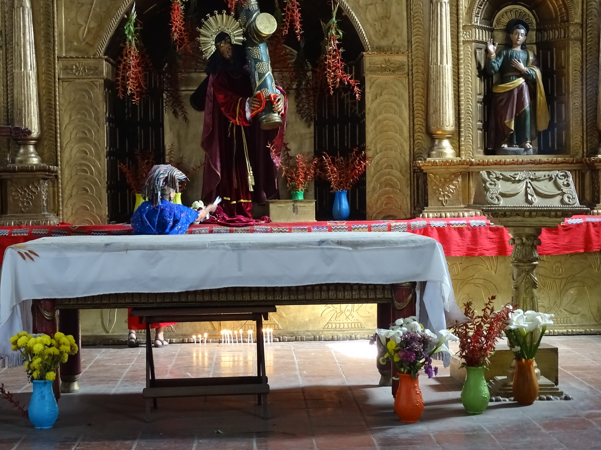

# 伊希尔玛雅民间天主教与祖灵祈福（Ixil）

<!-- 来源：CC BY-SA 2.0 | https://commons.wikimedia.org/wiki/File:Church_Nave_with_Worshippers_-_Chajul_-_Quiche_-_Guatemala_(15329416223).jpg -->

## 概述

**伊希尔人（Ixil）** 分布于危地马拉基切省高地（内巴赫、科萨尔、查胡尔一带公开地名）。公开记述：玛雅宇宙观与天主教圣徒交织；内战屠杀与战后记忆使祈福常与哀悼、正义相连——**须极度克制，勿消费创伤**。本条目为教育概览；**不提供**日数占卜操作、献牲或可冒充日师的步骤。与基切、卡克奇克尔、凯克奇条目可比较。

## 核心观念（祈福 / 功德 / 祈祷如何被理解）

祈福常被理解为：通过对祖先、山灵与圣人的敬意，求健康、玉米丰收与逝者安宁。功德贴近：支持语言、真相与和解进程，反对内战观光化。访客的「福」体现为：倾听而非猎奇，纪念场保持静默。

## 典型仪式

### 1. 主保节与教堂礼仪（概念层）
- **场合**：瞻礼、主日。
- **主要步骤（概念层）**：理解弥撒与公开游行。**止于观礼礼貌层**。
- **物品**：从略。
- **谁来举行**：神职与社群。

### 2. 山灵／十字架圣地敬礼（概念层）
- **场合**：个人与社群祈愿公开记述。
- **主要步骤（概念层）**：理解山地神圣地理。**禁止**复现祭仪。
- **物品**：从略。
- **谁来举行**：家庭与地方权威。

### 3. 哀悼与正义相关公共纪念（敏感，仅概念）
- **场合**：纪念日、公开听证记述。
- **主要步骤（概念层）**：理解祈祷与记忆交织。**勿消费创伤。**
- **物品**：从略。
- **谁来举行**：社群与人权组织（公开层）。

## 日常与节庆

优先伊希尔高地公开文化／人权叙述；注意与基切总览区分。

## 注意与尊重

**内战遗址勿自拍打卡。** 禁止日师游戏化。摄影须许可。

## 手机互动适合度（Three.js 评估草稿）

- **档位：** A 不建议做成操作型互动
- **敏感度：** 极高
- **判断：** 屠杀记忆与圣地不宜游戏化。
- **若做成互动：** 不建议；最多静态语言—玉米伦理说明。
- **红线：** 禁止占卜操作、献牲、冒充日师、消费创伤。
- **评估状态：** 待后期统一评估

## 参考来源

- https://www.britannica.com/topic/Ixil
- https://www.britannica.com/place/Guatemala
- https://www.britannica.com/topic/Maya-people
