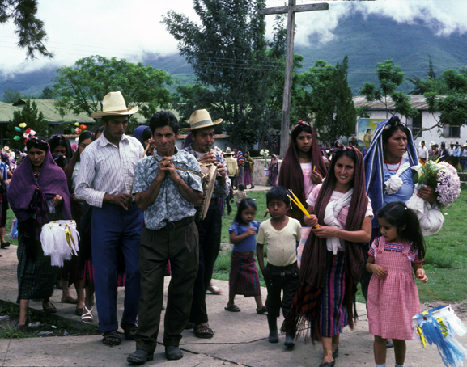

# 哈卡尔特克玛雅民间天主教与跨界祈福（Jakaltek／Popti'）

<!-- 来源：CC BY-SA 3.0 | https://commons.wikimedia.org/wiki/File:ChirimiaJacaltenango.jpg -->

## 概述

**哈卡尔特克人（Jakaltek；自称常作 Popti'）** 分布于危地马拉韦韦特南戈与墨西哥恰帕斯交界。公开记述：玛雅宇宙观与天主教圣徒交织；主保节 **Fiesta Patronal de Candelaria** 为公开观礼层；山灵／玉米伦理与 **Ah'kin** 日师属 **CONCEPT ONLY**——**users don't officiate**。本条目为教育概览；**不提供**日数占卜操作、献牲或可冒充日师的步骤。

## 核心观念（祈福 / 功德 / 祈祷如何被理解）

祈福常被理解为：通过对祖先、山灵、玉米与圣人的敬意，求家庭平安、丰收与跨境亲人安康。功德贴近：支持 Popti' 语与体面迁徙权利。访客的「福」体现为：参与／观礼 Candelaria 公开层，不把 **Ah'kin** 写成可扮演技能；**users don't officiate**。

## 典型仪式

### 1. Fiesta Patronal de Candelaria（公开主保节）
- **场合**：烛光圣母／主保瞻礼、游行与教堂礼仪。
- **主要步骤（概念层）**：理解弥撒、游行与社群宴庆。**止于公开观礼层**。
- **物品**：圣像游行外观（概念）。
- **谁来举行**：神职与社群；访客观礼——**users don't officiate**。

### 2. 山灵／玉米伦理（mountain／maize CONCEPT）
- **场合**：播种、求雨、农事公开记述。
- **主要步骤（概念层）**：理解山灵与玉米—雨水伦理。**CONCEPT**；禁止复现祭仪。
- **物品**：从略。
- **谁来举行**：家庭与地方权威。

### 3. Ah'kin 日师（CONCEPT ONLY）
- **场合**：生命礼仪、日历—危机叙事。
- **主要步骤（概念层）**：知晓存在日师职分。**CONCEPT ONLY**；禁止占卜操作化或「成为日师」教程。
- **物品**：从略。
- **谁来举行**：被承认的 Ah'kin；用户不可主持。

## 日常与节庆

优先跨界玛雅公开研究；注意与恰帕斯／危地马拉政治语境。

## 注意与尊重

**勿强求日师服务。** 边境地区遵守许可。禁止消费难民叙事。**Users don't officiate.**

## 手机互动适合度（Three.js 评估草稿）

- **档位：** B 仅氛围或图文场景
- **敏感度：** 高
- **判断：** **仅氛围／无用户主持。** Fiesta Patronal de Candelaria；Ah'kin CONCEPT ONLY；mountain/maize；占卜与边境创伤不可游戏化。
- **若做成互动：** 只做语言—玉米—主保节说明卡。
- **红线：** 禁止占卜操作、献牲、冒充日师、消费创伤。
- **评估状态：** 待后期统一评估

## 参考来源

- https://www.britannica.com/topic/Jacaltec
- https://www.britannica.com/place/Guatemala
- https://www.britannica.com/place/Chiapas
