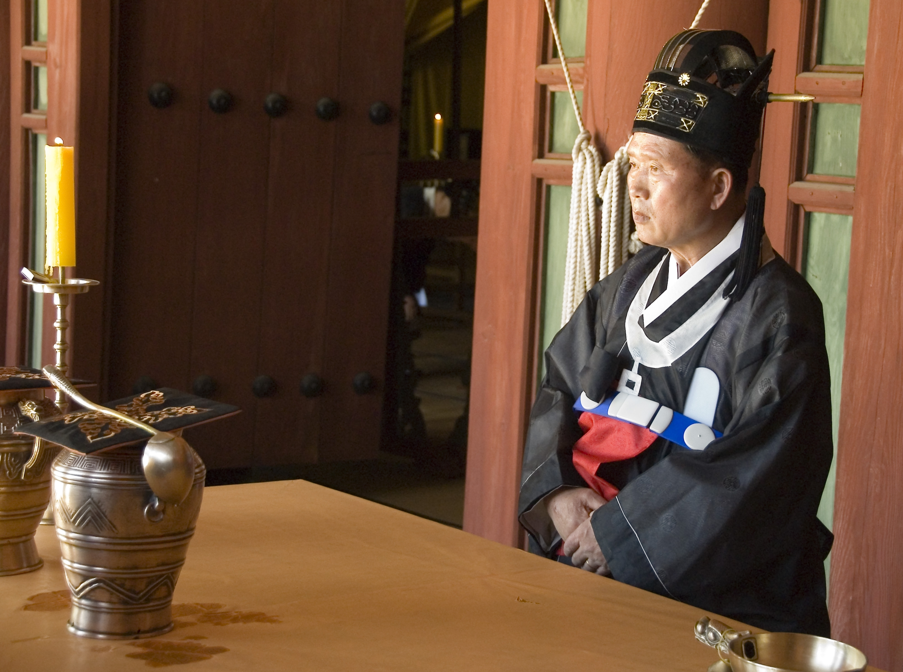

# 韩国宗庙祭礼（Jongmyo Jerye）

<!-- 来源：Public domain | https://commons.wikimedia.org/wiki/File:2008-Korea-Seoul-Jongmyo_jeryeak-05.jpg -->

## 概述

**宗庙（Jongmyo）** 位于今首尔，是朝鲜王朝（1392–1910）供奉历代国王与王妃神主的儒教王室宗庙。其建筑群于 1995 年列入联合国教科文组织**世界遗产**；**宗庙祭礼及其乐舞（Jongmyo Jerye and its music）** 于 2001 年被宣布为人类口述与无形遗产杰作，并于 2008 年转入《人类非物质文化遗产代表作名录》。教科文组织记述：祭礼一年一度（今多在五月第一个星期日）举行，由王室后裔等方面组织，是中国古典祭祖与孝道文本影响下、却已难在中国本土同形见到的儒教王室祭礼范例。乐舞含宗庙祭礼乐（Jongmyo Jeryeak）、颂赞祖先的歌诗与八佾之舞（文舞／武舞）等。本条目为教育性概览，说明公开遗产层结构与尊重边界；**绝非**可复现的祭祖操作手册，亦不可将宗庙祭礼理解为手机或旅游「可通关完成」的祭祖体验。

## 核心观念（祈福 / 功德 / 祈祷如何被理解）

宗庙祭礼的核心是**对王室祖先的祭祀与祈请永安**，并在儒教政治神学中象征王朝正当性与「为百姓和国家祈安」的公共责任。祈福表现为：以规定礼器献食献酒、乐舞相伴、祝祷祖先之灵安居于庙。所谓「功德」在此更接近**孝与礼的公共展演**——秩序、节度、服饰与乐悬各安其位——而非个人积点或家庭扫墓的私人版本。参观者可见建筑轴线、神门与正殿空间所体现的肃穆；真正献祭环节由受命的执礼者、乐工与舞员按历史仪轨进行。将之简化为「韩国版清明」或「通关祭祖」，会抹去其王室—国家礼仪与非物质文化遗产的双重身份。

## 典型仪式

### 1. 宗庙祭礼（Jongmyo Jerye）本祭（概念层）
- **场合**：年度大祭（今公开日程多在五月首个星期日）；历史上尚有更频繁的四时祭等（今以公开举行的大祭为外界可见焦点）。
- **主要步骤（概念层）**：迎神、奠币、进饌、初献／亚献／终献等献爵环节、饮福受祚、送神等（名称与分节依保存会与遗产说明）。执礼者着祭服，按位次以礼器献食与酒。公开描述止于环节名称与目的；**不提供**可照做的献爵动作、祝文全文或排位清单。
- **物品**：籩豆等礼器、祭服、神主殿宇空间。
- **谁来举行**：受认可的宗庙祭礼保存会与相关礼乐团体；王室后裔参与组织。非游客可「客串主祭」。

### 2. 宗庙祭礼乐与佾舞（概念层）
- **场合**：与正祭同步；平台上下分置乐队。
- **主要步骤（概念层）**：以钟磬、弦管等演奏；歌诗颂祖先功德；六十四人排成八行，文舞与武舞分别象征阴阳与文武事功（教科文组织文本）。国立国乐院等机构参与保存。止于公开表演—礼仪结构。
- **物品**：传统雅乐器、佾舞服饰。
- **谁来举行**：受训乐工与舞员；非即兴街头表演。

### 3. 世界遗产地参观与旁观（概念层）
- **场合**：平日开放参观的宗庙建筑与园林；祭礼当日的有限旁观。
- **主要步骤（概念层）**：沿指定路线参观正殿、永宁殿等外观与院落；祭礼时服从警戒与摄影规定，保持静肃。参观**不等于**参与献祭。
- **物品**：参观票据与导览（行政层）。
- **谁来举行**：文化遗产管理机构；访客为旁观者。

## 日常与节庆

宗庙平日是重要的历史—礼仪空间，氛围肃穆，与周边都市形成对比。年度祭礼吸引大量观众与媒体，但核心仍是保存会主导的正式仪轨。当代韩国宗教景观多元，基督教等传统兴起使部分人对儒教王室祭礼感到疏离；国家与社区仍以文化遗产法加以保护。家庭祭祀（家庙、忌日）与宗庙王室祭礼层级不同，不可混为一谈。

## 注意与尊重

**勿将宗庙祭礼写成或做成「可通关祭祖」游戏。** 勿闯入祭位、触碰礼器与神主空间，勿在仪式进行时大声解说或拍摄受禁区域。勿冒充执礼者或要求「体验献爵」。尊重世界遗产与国家级无形遗产的保存规范；讨论王朝历史时避免戏说亵渎。

## 手机互动适合度（Three.js 评估草稿）

- **档位：** A 不可做成关卡
- **敏感度：** 高
- **判断：** 宗庙祭礼为王室儒教正式祭祀，含迎神、献食献酒与乐舞；由保存会与执礼者主持。文件明确反对写成可通关祭祖。
- **若做成互动：** 不提供操作步骤。
- **红线：** 禁止模拟献爵、祝祷、排布神主或佾舞通关；不以 Jongmyo Jerye／宗庙祭礼完成度作胜负。
- **评估状态：** 待后期统一评估

## 参考来源

- https://ich.unesco.org/en/RL/royal-ancestral-ritual-in-the-jongmyo-shrine-and-its-music-00016
- https://whc.unesco.org/en/list/738/
