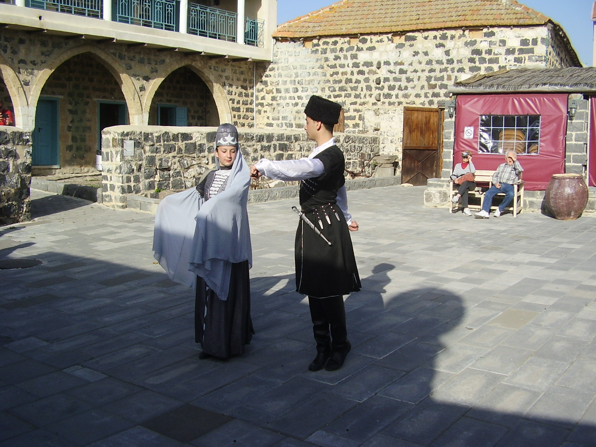

# 卡巴尔达民间伊斯兰与切尔克斯习惯祈福（Kabardian）

<!-- 来源：CC BY 2.5 | https://commons.wikimedia.org/wiki/File:PikiWiki_Israel_19128_Circassian_dancers_in_Kafr_Kama_Israel.JPG -->

## 概述

**卡巴尔达人（Kabardian）** 为切尔克斯（阿迪格）人重要支系，主要分布于俄罗斯卡巴尔达—巴尔卡尔等地，绝大多数为逊尼派穆斯林。公开概述记述：清真寺礼仪与 **Adyge Khabze** 荣誉—好客习惯法深度交织；**Thashxwe** 等生命礼仪／节庆公开层；**Nart** 史诗为文化认同叙事；苏菲 **zikr** 属 **viewing-only**——**users don't officiate**。本条目为教育概览；**不提供**教团秘仪或政治动员话术。

## 核心观念（祈福 / 功德 / 祈祷如何被理解）

祈福常被理解为：通过礼拜、施舍与维护 **Adyge Khabze** 伦理，求家庭荣耀与社区安宁。功德贴近：支持语言、流散连结与 Nart 史诗传承。访客的「福」体现为：旅行低调、尊重长者座次与好客规范，对 zikr 仅观礼；**users don't officiate**。

## 典型仪式

### 1. Thashxwe 与伊斯兰公开礼仪（概念／公开层）
- **场合**：主麻、开斋、宰牲节与地方公开节庆／生命礼仪叙述。
- **主要步骤（概念层）**：理解公开伊斯兰框架与 **Thashxwe** 相关公共层。**止于常识／观礼。**
- **物品**：从略。
- **谁来举行**：伊玛目与信众——**users don't officiate**。

### 2. Adyge Khabze 好客与 Nart 史诗（概念／文化层）
- **场合**：婚丧、尊客宴；史诗吟唱与认同教育。
- **主要步骤（概念层）**：理解荣誉、好客、和解伦理与 **Nart** 史诗作为文化记忆。**勿猎奇。**
- **物品**：从略。
- **谁来举行**：家庭、长者与文化传承者。

### 3. 苏菲 zikr（viewing-only）
- **场合**：教团聚会、圣地还愿公开记述。
- **主要步骤（概念层）**：理解 zikr 作为记主／集体记诵实践。**viewing-only**；禁止编造介祷配方或冒充教团成员。
- **物品**：从略。
- **谁来举行**：教团与地方权威；用户不可主持。

## 日常与节庆

优先 Britannica 切尔克斯／卡巴尔达公开层；注意安全语境。

## 注意与尊重

**勿把高加索议题政治化猎奇。** 禁拍未同意对象。禁止政治煽动。**Users don't officiate.**

## 手机互动适合度（Three.js 评估草稿）

- **档位：** B 仅氛围或图文场景
- **敏感度：** 高
- **判断：** **仅氛围／无用户主持。** Thashxwe；Adyge Khabze hospitality；Nart epic；Sufi zikr viewing-only；礼拜与创伤不可游戏化。
- **若做成互动：** 只做哈布泽伦理／Nart 说明卡。
- **红线：** 禁止礼拜通关、zikr 操作化、政治动员。
- **评估状态：** 待后期统一评估

## 参考来源

- https://www.britannica.com/topic/Kabarda
- https://www.britannica.com/topic/Circassian
- https://www.britannica.com/topic/Islam
