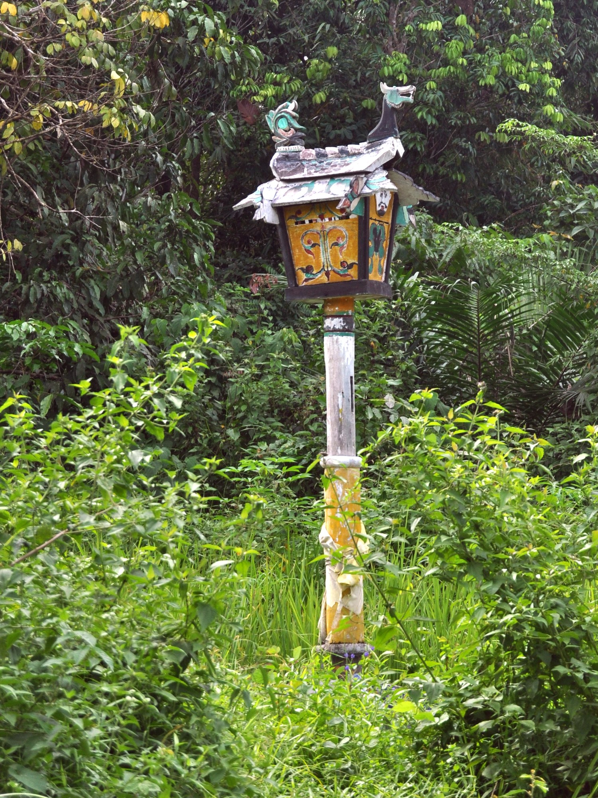

# 婆罗洲达雅克 Kaharingan／祖先与二次葬仪礼

<!-- 来源：CC BY-SA 3.0 | https://commons.wikimedia.org/wiki/File:Sandung_101014-7588_mp.JPG -->

## 概述

**Kaharingan** 是印度尼西亚加里曼丹等地达雅克族群——尤其中加里曼丹 Ngaju 人——的传统宗教自称。信仰包含高位创世神 **Ranying Hatalla Langit**、众灵与祖先；礼仪专家 **Basir** 属 **CONCEPT**——**users don't officiate**；家族骨匣 **Sandung** 与二次葬 **Tiwah** 为 **viewing-only restricted**。本条目为高层次概览；**不提供**献牲数量、掘骨操作或祭司祷词教程。

## 核心观念（祈福 / 功德 / 祈祷如何被理解）

核心是亲属义务与宇宙秩序：活人须透过正确礼仪「发送」死者。祈福与平安来自维持与祖先、善灵及 **Ranying Hatalla Langit** 的正当关系。功德体现为承办或参与 tiwah、供养祭司、建造 sandung。访客的「福」体现为：若受邀仅旁观，服从界限；**users don't officiate**。

## 典型仪式

### 1. Tiwah／Sandung（viewing-only restricted）
- **场合**：死后数年，家族筹得资源后举行二次葬；遗骨迁入 **sandung**。
- **主要步骤（概念层）**：理解迁骨、宴请、祷唱的宇宙观意义。**viewing-only restricted**；本档案**仅承认事实，不提供任何操作说明**。
- **物品**：sandung 外观（概念）。
- **谁来举行**：家族与传统祭司；用户不可主持。

### 2. Ranying Hatalla Langit（概念层）
- **场合**：创世—高位神公开叙述。
- **主要步骤（概念层）**：理解高位神作为宇宙秩序源头的概念。**CONCEPT**；非操作祷告脚本。
- **物品**：从略。
- **谁来举行**：信众与职人语境下的概念理解。

### 3. Basir（CONCEPT——users don't officiate）
- **场合**：祷唱、护送灵魂与 tiwah 主持公开民族志。
- **主要步骤（概念层）**：知晓 **Basir** 职分。**CONCEPT**；**users don't officiate**；禁止祷词／通灵教程。
- **物品**：从略。
- **谁来举行**：受认可的 Basir；外人不得自称。

## 日常与节庆

Kaharingan 今日为少数，但仍以联合 tiwah、宗教教育与文化论述争取存续。游客若受邀旁观，须服从摄影与行动界限。

## 注意与尊重

勿索要掘骨、献牲配方或祭司唱词。勿擅自触摸 sandung。**Users don't officiate.**

## 手机互动适合度（Three.js 评估草稿）

- **档位：** B 仅氛围或图文场景
- **敏感度：** 高
- **判断：** **仅氛围／无用户主持。** Tiwah/Sandung viewing-only restricted；Ranying Hatalla Langit；Basir CONCEPT — users don't officiate。
- **若做成互动：** 只做可旋转 sandung 外观与说明卡，不作主持或献祭。
- **红线：** 不提供掘骨／牲礼步骤、祭司祷词；不以 tiwah 完成度作胜负。
- **评估状态：** 待后期统一评估

## 参考来源

- https://www.britannica.com/topic/Dayak
- https://online.ucpress.edu/nr/article/25/4/64/168635/Kaharingan-or-Hindu-KaharinganWhat-s-in-a-Name-in
- https://doi.org/10.1525/nr.2022.25.4.64
- https://jayapanguspress.penerbit.org/index.php/JPAH/article/view/1523
- https://global.oup.com/academic/product/small-sacrifices-9780195095586
