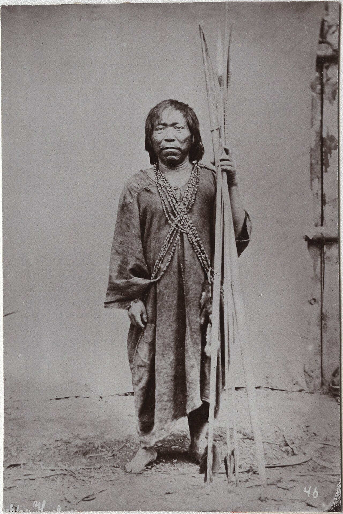

# 卡卡泰博传统信仰与雨林祈福（Kakataibo）

<!-- 来源：Public domain | https://commons.wikimedia.org/wiki/File:Cashibo_man_photographed_in_1888_by_Charles_Kroehle.jpg -->

## 概述

**卡卡泰博人（Kakataibo；历史文献或作 Cashibo 等相关他称）** 分布于秘鲁乌卡亚利一带，属帕诺语支。公开概述记述：传统宇宙强调森林、祖先与治疗伦理；今日并存基督教与土地维权。本条目为教育概览；**严禁**致幻操作、疗愈脚本或可冒充萨满的步骤。与卡希纳瓦／希皮博条目语支相关但社群独立，不可合并。

## 核心观念（祈福 / 功德 / 祈祷如何被理解）

祈福常被理解为：通过对森林与祖先的正确关系，求健康、渔猎平安与领地存续。功德贴近：支持卡卡泰博语与土地权利。访客的「福」体现为：拒绝死藤水／疗愈旅游套餐。

## 典型仪式

### 1. 森林—祖先伦理（概念层）
- **场合**：渔猎、农事公开记述。
- **主要步骤（概念层）**：理解分享与地点尊重。**禁止**复现祭仪。
- **物品**：从略。
- **谁来举行**：家庭与长者。

### 2. 治疗中介（极高敏感，仅概念）
- **场合**：疾病叙事。
- **主要步骤（概念层）**：知晓存在萨满—治疗传统。**禁止任何操作化。**
- **物品**：从略。
- **谁来举行**：被承认的专家。

### 3. 基督教接触层（概念层）
- **场合**：部分社区公开记述。
- **主要步骤（概念层）**：理解信仰光谱。**止于公开层**。
- **物品**：从略。
- **谁来举行**：相关宗教权威。

## 日常与节庆

优先乌卡亚利公开文化／权利叙述。

## 注意与尊重

**严禁致幻旅游。** 尊重自我认同名称（慎用旧他称）。摄影须许可。

## 手机互动适合度（Three.js 评估草稿）

- **档位：** A 不建议做成操作型互动
- **敏感度：** 极高
- **判断：** 萨满—致幻核心不可游戏化。
- **若做成互动：** 不建议；最多静态生态—权利说明。
- **红线：** 禁止致幻剂、疗愈脚本、冒充萨满。
- **评估状态：** 待后期统一评估

## 参考来源

- https://www.britannica.com/place/Ucayali
- https://www.britannica.com/place/Peru
- https://www.britannica.com/place/Amazon-Rainforest
