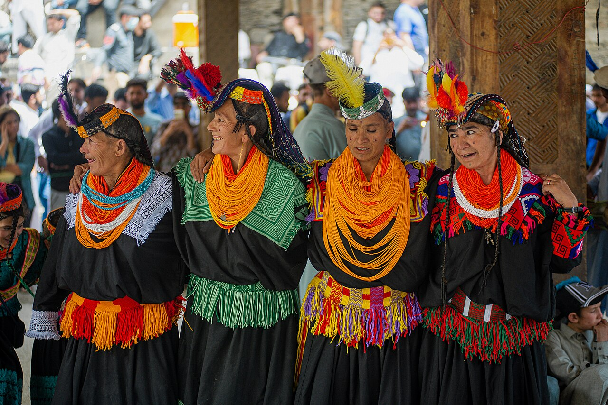

# 卡拉什（Kalasha / Kalash）

<!-- 来源：CC BY-SA 3.0 | https://commons.wikimedia.org/wiki/File:Chilam_joshi_festival_1.jpg -->

## 概述

卡拉什人是巴基斯坦奇特拉尔地区本布勒特、伦布尔与比里尔等山谷中的小型印欧语系原住民族群，是该区域少数仍延续前伊斯兰多神—万物有灵传统的共同体。公开节庆包括 **Chilam Joshi**（春）公共层、**Uchaw** 秋收，以及 **Chawmos**——**HIGH SENSITIVITY viewing/respect only**；家屋／生育相关神 **Dezalik** 属 **CONCEPT**——**users don't officiate**。本条目为教育性概览，不对献牲程序、洁净禁忌执行细节或限制性仪轨提供操作说明。

## 核心观念（祈福 / 功德 / 祈祷如何被理解）

祈福与感谢深深嵌入**岁时循环**：春季迎接乳汁与新生、夏秋祈求麦作丰收、隆冬以宴乐与仪典迎接新年。访客的「福」体现为：在公共节庆保持尊重距离，对 **Chawmos** 高度敏感场合仅观礼／尊重；不把 **Dezalik** 写成可扮演技能；**users don't officiate**。

## 典型仪式

### 1. Chilam Joshi 春季节庆（公共层）
- **场合**：约五月，迎接春天、祝福畜群与社群更新。
- **主要步骤（概念层）**：公开叙述包括「乳日」等环节与歌舞欢庆。**止于公共观礼层。**
- **物品**：乳制品、节庆服饰外观（概念）。
- **谁来举行**：卡拉什社群；访客遵从长老——**users don't officiate**。

### 2. Uchaw 秋收仪典（公开／概念层）
- **场合**：约八月末，祈求或感谢小麦等作物收成。
- **主要步骤（概念层）**：歌舞、谢神与共同体聚会。**止于概念／公开层。**
- **物品**：谷物与节庆供物外观（概念）。
- **谁来举行**：各山谷社群。

### 3. Chawmos 与 Dezalik（HIGH SENSITIVITY viewing／respect；Dezalik CONCEPT）
- **场合**：约十二月冬至前后最重要年度节庆；家屋／生育神 **Dezalik** 相关叙事。
- **主要步骤（概念层）**：理解岁末更新与神灵造访的宇宙观。**HIGH SENSITIVITY viewing/respect only**；**Dezalik CONCEPT**；不提供宰杀或程序化操作说明。
- **物品**：从略。
- **谁来举行**：全社群与仪式专责者；用户不可主持。

## 日常与节庆

日常宗教生活分布于家屋神灵、开敞祭坛与季节牧道之间。近数十年旅游与改宗压力改变山谷生态。

## 注意与尊重

卡拉什人是人口极少的宗教少数群体，拍摄面容、葬礼、圣地与妇女须严格征得同意。勿强行介入献牲或洁净区域。**Users don't officiate.**

## 手机互动适合度（Three.js 评估草稿）

- **档位：** B 仅氛围或图文场景
- **敏感度：** 高
- **判断：** **仅氛围／无用户主持。** Chilam Joshi public；Uchaw harvest；Chawmos HIGH SENSITIVITY viewing/respect only；Dezalik CONCEPT。
- **若做成互动：** 可不做操作关卡，只做可旋转场景与说明卡。
- **红线：** 禁止介入献牲／洁净区、未经同意拍摄，或以节名作通关。
- **评估状态：** 待后期统一评估

## 参考来源

- https://www.encyclopedia.com/humanities/encyclopedias-almanacs-transcripts-and-maps/kalasha
- https://www.worldhistory.org/Kalasha/
- https://whc.unesco.org/en/tentativelists/6965/
