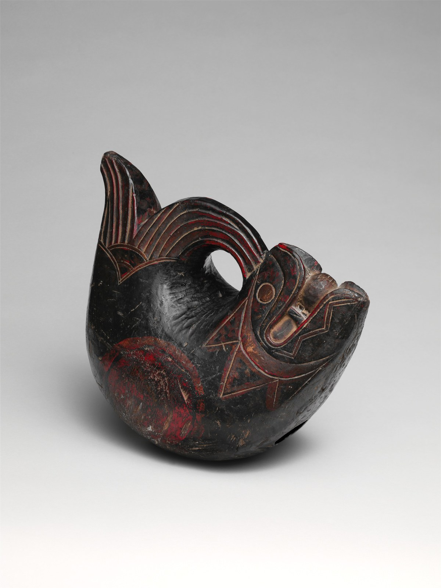

# 木鱼（mokugyo）

<!-- 来源：Public Domain / Met Open Access | https://www.metmuseum.org/art/collection/search/505614 -->

## 概述

木鱼（日语 *mokugyo*；汉语亦称木鱼／*muyu*）是东亚佛教寺院的敲击法器。本卡定位为 **A 文化物件·法器专题**，而非完整宗教仪轨的说明。大都会艺术博物馆与宾夕法尼亚大学博物馆的馆藏说明指出其核心用途：以规律敲击**伴诵经文**、统一课诵节律；「鱼」之形名取**鱼无眼睑、终目不闭**之意，象征醒觉精勤，部分形制口衔宝珠，Met 说明引申为宇宙象征。形制须分三层：**团栾圆型木鱼**（头尾相接、腹空，置于垫上敲击，是诵经伴奏主型，馆藏多见江户—明治日本实例，手持小型与垫上大型均有）；**悬挂长条鱼板／鱼鼓（*gyoban*）**（用于集众与日程信号，**勿与圆型木鱼混为一物**）；以及较具象的鱼形（如 Met 藏清代至近代云南 *muyu*）。圆型木鱼在中国定型并东传的**精确系年史料仍薄，标待核实**；傅大士等创制传说属后世叙述，不作史实。课诵与供养的整体宗教语境见 `chinese-buddhism.md` 等条目——**本卡 ≠ 完整课诵仪轨**。

## 核心观念（祈福 / 功德 / 祈祷如何被理解）

在寺院语境中，木鱼是**节律与醒觉**之物：鱼无睑不眠，提醒诵经者精勤勿堕昏沉；敲击为诵经定拍，鱼板敲击则为集众报时。其意义依附于课诵与修行日程的整体实践，**不独立构成功德**，更无「敲若干下得若干福报」的点数化理解——任何功德化叙述都偏离其法器本义。对在家者而言，木鱼更多是寺院声音景观的一部分。产品与科普应止步于**用途与象征层（A）**：伴诵、节律、醒觉；不把敲击动作说成消业、开光或等同诵经。

## 典型仪式

### 1. 课诵伴奏（概念层）
- **场合**：寺院早晚课诵、法会诵经。
- **主要步骤（概念层）**：以木槌在垫上圆型木鱼敲出稳定节拍，伴诵经文；禅寺中常与磬（*keisu*）等法器配合。此为公开可理解的寺院声音实践，**本卡不作课诵教程**。
- **物品**：中空圆型木鱼、木槌、软垫；磬（外观概念）。
- **谁来举行**：僧侣与课诵大众；在家信众一般在寺院闻其声。

### 2. 集众与日程信号（gyoban，概念层）
- **场合**：禅寺作息——集众、报时、日程转换。
- **主要步骤（概念层）**：敲击悬挂的长条鱼板以号令大众；与案头圆型木鱼**形制与职能不同，勿混为一物**。
- **物品**：悬挂鱼板（*gyoban*）与槌。
- **谁来举行**：寺院执事。

## 日常与节庆

木鱼嵌在寺院每日课诵的节奏中，节庆法会里敲击愈密；馆藏的江户—明治日本实例与清代以来的中国 *muyu* 说明其在东亚佛教长期通行。文献层可见明代《三才图会》等已述刻木为鱼、中空敲击，团栾形制亦有清代僧叙述等线索，但**圆型定型的精确系年仍待核实**——凡「某某年发明」的断代表述都应避免。作为法器专题，本卡不把木鱼抽离课诵语境当作「许愿物件」。

## 注意与尊重

参观寺院时勿随手敲打法器——法器是修行用具而非玩具。区分圆型木鱼与悬挂鱼板，勿混称。傅大士、志林等创制传说是后世叙述，勿当史实引用。媒体与产品叙述禁用「消业点数」「开光完成」一类功德化、仪式化说法。

## 手机互动适合度（Three.js 评估草稿）

- **档位：** C 可做致敬小品（非真仪）
- **敏感度：** 低
- **判断：** 木鱼为 **A 文化物**，点按节律手势可作 **C 手势简化**的疗愈致敬；无秘仪风险，但绝不等同课诵或功德。
- **若做成互动：** 手机手势练习（致敬小品，非寺院课诵）：

1. 奶油暖木色的圆型木鱼置于软垫，点按时轻震动＋一圈涟漪。
2. 跟随缓慢节拍轻敲，界面只写「静一下」。
3. 稳定敲击片刻后浮出「醒觉」一词与一次深呼吸提示。
4. 附一句科普「寺院中常与磬配合」，不做双法器闯关。
- **红线：** 禁用「消业点数」「开光完成」「敲够解锁」等反馈；不称「完成课诵」。
- **评估状态：** 待后期统一评估

## 参考来源

- https://www.metmuseum.org/art/collection/search/502274
- https://www.metmuseum.org/art/collection/search/505614
- https://collections.penn.museum/collections/object/277977
