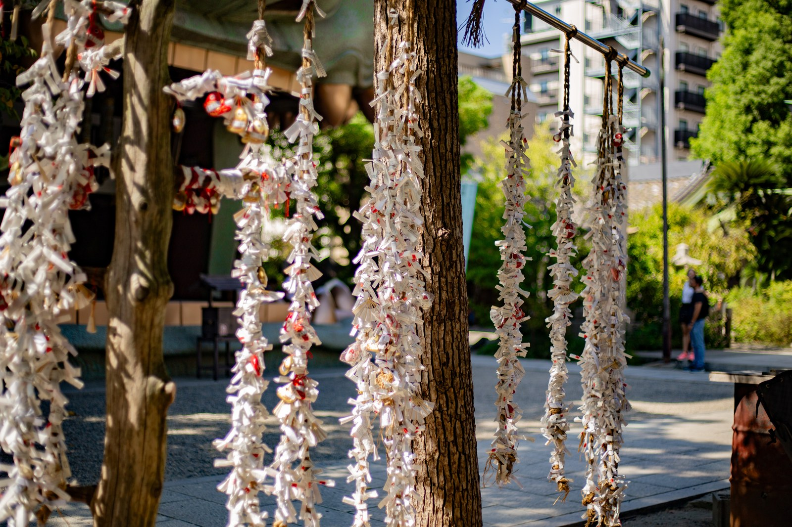

# 御神签（omikuji）

<!-- 来源：CC BY-SA 4.0 | https://commons.wikimedia.org/wiki/File:Omikuji_at_Namba_Yasaka_Shrine_Osaka.jpg -->

## 概述

御神签（*omikuji*，亦称 *mikuji*）是**神社（亦见于寺院）抽签问运的纸签实践（A）**：摇签筒得编号、对取签文，阅读运势与各项提示。国学院大学 EOS 记述其作为询神意／判吉凶的抽签形态；今日常见为签筒抽签棒再对号取纸签。日本国家旅游局（JNTO）刊物亦说明吉签多可携回、凶签常折系于境内指定绳架或处所——各社规定不一。神道参拜整体见 `shinto.md`；本卡**聚焦抽—读—折系的短互动**，强调自省参考，而非命运判定或算命商业化。

## 核心观念（祈福 / 功德 / 祈祷如何被理解）

御神签的心意是**领一份可阅读的提示，再自己决定如何收纳**：签文给出大运等级与各项建议，读完即完成主要动作。吉签携回、凶签折系，是常见习惯层叙述（JNTO），但并非全国唯一规范——有的社鼓励两种皆可。它**不是**算命交易，也没有「抽到凶＝失败」的胜负；产品应把签文读成自省提示，而非命运宣判。

## 典型仪式

### 1. 抽签、阅读、折系（概念层）
- **场合**：参拜延伸；初诣人潮尤多；亦见于寺院。
- **主要步骤（概念层）**：依各社方式投币／领取；摇签筒抽出编号签棒（或他法）；对号取纸签并阅读；吉签或携回，凶签常折系于指定绳架／处所（以现场告示为准，勿伤树木）。
- **物品**：签筒、签棒、纸签。
- **谁来举行**：信众与访客个人。

## 日常与节庆

御神签是**参拜延伸**，非每日必抽。正月初诣最盛，其余时节随个人前往。签文版权与多语版本因社而异；本卡不收录具体签文。抽签方法的历史层以 EOS 为准，折系习惯以 JNTO 等机构公开叙述为辅，地方差异标 **待核实** 处从现场。

## 注意与尊重

不声称销售「真神签」或可复现某社签文。尊重签文版权，产品用原创提示句，不抄录现实签诗。折系用指定架，不鼓励损伤树枝。不做「凶签＝失败／要重抽通关」的游戏逻辑；强调阅读与自省。

## 手机互动适合度（Three.js 评估草稿）

- **档位：** C 可做致敬小品（非真仪）
- **敏感度：** 低–中（运势焦虑、商业化风险）
- **判断：** 「摇签→展开→（可选）折系虚拟绳」手势完整，与绘马书写墙差异化明显。
- **若做成互动：** 手机手势练习（致敬小品，非神社实务）：

1. 奶油色庭前，一只轻木签筒。
2. 轻摇手机或上滑，抽出一张签纸展开。
3. 读一句温和的原创提示（非命运宣判）。
4. 若抽到「需小心」档，可折系到虚拟绳架；吉签可收进小信封。界面留一句：先记下，慢慢走。
- **红线：** 不做算命收费暗示；不抄录现实签文；不设凶签失败重抽／通关；不称真神签；不做功德计数。
- **评估状态：** 待后期统一评估

## 参考来源

- https://d-museum.kokugakuin.ac.jp/eos/detail/?id=9959
- https://www.japan.travel/en/japan-magazine/2007_omikuji/
