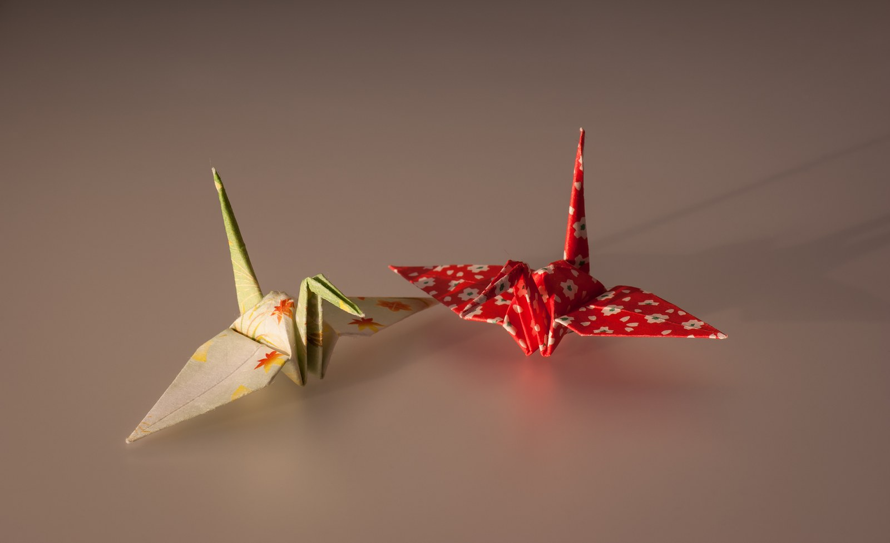

# 折纸鹤与千羽鶴（origami crane / senbazuru）

<!-- 来源：Public Domain | https://commons.wikimedia.org/wiki/File:Cranes_made_by_Origami_paper.jpg -->

## 概述

折り鶴（折纸鹤）与串连成帘的**千羽鶴（*senbazuru*）**主要属 **B 当代民俗愿望习惯**，并含 **A 折纸工艺史**与 **A 和平纪念史实**两个可核验层面；研究明确提示**不归入神道、佛教或任何单一宗教**——本卡因此独立于 `shinto.md` 等宗教条目，定位为工艺／民俗／纪念专题。工艺层（A）：鹤是最常见的折纸题材之一，1797 年京都出版的《秘伝千羽鶴折形》（*Hiden Senbazuru Orikata*，作者考定为桑名长远寺僧 Roko-an Gido）记载的是**一纸连折多鹤的「连鹤」（*renzuru*）**，**并非**「折满一千只单鹤必圆愿」的教本；1976 年桑名市将「桑名の千羽鶴」指定为市无形文化财。愿望层（B）：鹤为长寿吉祥之象（「鹤千年、龟万年」类谚语），串起许多折鹤以表达病愈、长寿、心愿与安稳的祝愿，「集千羽愿望更易成真」属民间信念层（政府刊物转述广岛和平纪念资料馆职员叙述）。和平纪念层（A）：佐々木禎子 1955-10-25 因原爆相关白血病去世，同学发起募款，**1958-05-05** 广岛「原爆の子の像」（儿童和平纪念碑）落成；折鹤自此成为全球和平象征，每年约一千万羽（约十吨）奉献至纪念碑。前现代「折千只单鹤必圆愿」的直接文献系年**仍待核实**。

## 核心观念（祈福 / 功德 / 祈祷如何被理解）

千羽鶴的祈愿是**民俗心意层（B）**：以耐心折叠与串连，把祝愿——多为病愈、长寿、安稳——具象地送给对方；「千羽则愿成」是民间信念而非宗教教义，没有功德账簿或神人契约的框架。另一重意义是**和平纪念（A）**：在广岛原爆之子像前，折鹤是公开的哀悼与祈愿语言——纪念死于原爆后遗症的儿童、祈愿世界和平，庄重而非喜庆。工艺层（A）则视折鹤为和纸折形传统的题材，讲手艺与传承（桑名连鹤的复原传授）。三层各有边界：**不写成神社或寺院的奉纳必修仪轨，不虚构「古代神社折鹤仪轨」，不宣称折满千数必然应验**。

## 典型仪式

### 1. 折鹤与串千羽鶴（民俗愿望层 B）
- **场合**：探病慰问、祝寿、应援活动、社区心愿墙。
- **主要步骤（概念层）**：以方纸折成鹤形；将许多纸鹤串连成帘，附祝愿心意送出或悬挂。
- **物品**：色纸、线、串架。
- **谁来举行**：个人、同学同事与社区群体；无宗教职务参与。

### 2. 和平纪念奉献（A）
- **场合**：广岛「原爆の子の像」的常年奉献；学校和平教育与纪念活动。
- **主要步骤（概念层）**：折鹤（常集为千羽串）寄送或携至纪念碑奉献，寄托哀悼与和平祈愿；广岛市并推动奉献折鹤的再生与循环利用。
- **物品**：千羽鶴串、奉献承接设施。
- **谁来举行**：世界各地的个人、学校与团体。

### 3. 连鹤工艺传习（A）
- **场合**：折纸工艺传习与展示。
- **主要步骤（概念层）**：承 1797 年《秘伝千羽鶴折形》一纸连折多鹤的工艺传统；桑名市博物馆研究员等从事复原传授。
- **物品**：和纸、折形图。
- **谁来举行**：工艺家与传习者；桑名市 1976 年指定为市无形文化财。

## 日常与节庆

折鹤是随手可成的小手工：千羽鶴常见于病房慰问、庆典装饰与社区祈愿活动；和平纪念层面全年持续——每年约一千万羽折鹤抵达广岛纪念碑，广岛市 2012 年起推动「折鹤再生・循环」项目。研究提示：战前神社奉献千羽的叙述只见于二手民俗文，**前现代「千鹤必圆愿」的系年文献仍薄（待核实）**；1977 年英文童书 *Sadako and the Thousand Paper Cranes* 含文学化情节，叙事应以广岛市与和平纪念馆官方表述为准。

## 注意与尊重

和平纪念场景须**庄重**：勿将佐々木禎子与原爆之子像的故事猎奇化、游戏化或作煽情消费。勿把折鹤说成任何宗教的仪轨、圣物或奉纳义务；勿宣称「折满一千只必如愿」。纪念碑前的奉献折鹤是公开祈愿与纪念物，不得取走或破坏。

## 手机互动适合度（Three.js 评估草稿）

- **档位：** C 可做致敬小品（非真仪）
- **敏感度：** 中（和平纪念层须庄重）
- **判断：** 折叠成形的工艺手势适合手机致敬；定位为 **B 大众祈愿／和平心意＋工艺手势**，无宗教秘仪风险，但和平场景不可娱乐化。
- **若做成互动：** 手机手势练习（致敬小品，非任何宗教仪轨）：

1. 奶油暖色方纸随指尖拖出四步折痕，纸鹤渐次成形。
2. 成形后写一句「一羽心愿」，轻放入暖光纸盒。
3. 可选「串入千羽墙」：纸鹤汇入缓缓流动的千羽帘，安静无排名。
4. 和平纪念模式转庄重留白，只余一句祈愿语，无积分与音效奖励。
- **红线：** 不绑定任何宗教；和平场景禁用庆祝式通关反馈；不虚构「古代神社折鹤仪轨」；不写「折满即灵验」。
- **评估状态：** 待后期统一评估

## 参考来源

- https://www.city.hiroshima.lg.jp/english/peace/1033408/1009685.html
- https://www.pref.hiroshima.lg.jp/site/hiroshimaforpeace-en/childrens-peace-monument.html
- https://www.gov-online.go.jp/eng/publicity/book/hlj/html/202112/202112_06_en.html
- https://www.gov-online.go.jp/eng/publicity/book/hlj/html/202312/202312_07_en.html
