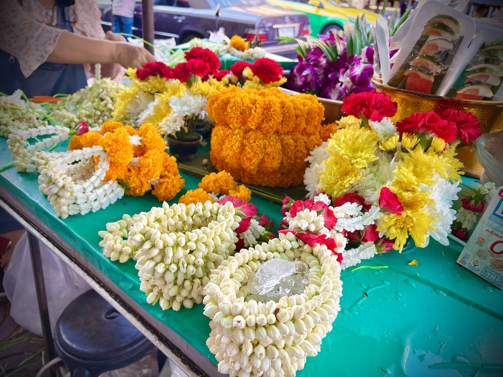

# 泰国花环（phuang malai／พวงมาลัย）

<!-- 来源：CC BY 2.0 | https://commons.wikimedia.org/wiki/File:Bangkok,_Thailand,_March_2023_-_Jasmine_phuang_malai_(flower_garland).jpg -->

## 概述

*Phuang malai*（พวงมาลัย）是**泰国礼敬与供养常见的鲜花串环（A）**：以茉莉等鲜花串成环状或带穗的花环，献给佛像、僧侣、神屋、长辈与贵客，亦见于车辆后视镜等日常求安场合。仓库 `thai-spirit-houses.md` 已将花环列为神屋公开供品之一（与 Nam Daeng 等并列），康奈尔大学相关民族志材料亦支撑神屋供养结构的公开叙述。本卡**聚焦花环物件与短互动**，不展开安座／请灵；与夏威夷 *lei* **不是文化等价物**——产品须分述，禁止「热带花环」混皮肤。完整花艺史与曼谷花博物馆等专史机构英页在候选研究中仍标为缺口（**待核实**），本卡不写成结论。

## 核心观念（祈福 / 功德 / 祈祷如何被理解）

花环的心意是**把尊敬与感谢「捧」到对方眼前**：一串鲜花、一次合十，是欢迎、致谢、祝福与礼敬的可见记号。在神屋语境中，它属于维持与地方守护灵互惠关系的日常供品；在寺院与人际场合，它是礼敬姿态，**不是**功德计量工具，也没有「献完即灵验」的结算。佛教语境中的功德仍主要透过布施僧团、持戒与禅修等路径理解；本卡只谈花环作为礼敬物的公开层。

## 典型仪式

### 1. 献花环／捧献礼敬（概念层）
- **场合**：神屋日常供养；寺院礼佛；迎接长辈／贵客；车辆等日常求安（地方习惯不一）。
- **主要步骤（概念层）**：备一串鲜花花环；捧献或挂放于龛前、佛像前、或礼敬对象；合十致意。公开文化叙述止于此；**不描述**安座、请灵或迁龛程序（见 `thai-spirit-houses.md` CONCEPT ONLY）。
- **物品**：茉莉等鲜花串成的 *phuang malai*（形制多样，本卡不枚举工艺变体）。
- **谁来举行**：住户、店员、信众与礼敬者个人；无职务要求。

## 日常与节庆

花环是**高日常、低节历刚性**的礼敬物：神屋与街景中几乎随时可见，亦可随佛日、节庆与迎送场合加重。它不作「每日必献」的课诵式义务，也无统一全国的献环节历。工艺形制与专史断代以现有学术／仓库叙述为限，花博物馆闭馆后的替代一级英页仍 **待核实**，不展开。

## 注意与尊重

标明泰国礼敬物身份，**不与夏威夷 lei 或其他「热带花环」混名混皮肤**。不编安座／请灵步骤；不鼓励取走他人供品当纪念品。鲜花意象保持庄重，不做猎奇鬼片化。探访神屋与公共神社遵守现场规范。

## 手机互动适合度（Three.js 评估草稿）

- **档位：** C 可做致敬小品（非真仪）
- **敏感度：** 低–中（神屋／佛教礼敬边界）
- **判断：** 「串花→捧献」手势短而清晰，与神屋卡的供养层衔接，适合感谢短互动。
- **若做成互动：** 手机手势练习（致敬小品，非礼敬实务）：

1. 奶油暖色的小龛或「感谢对象」卡片前，几朵茉莉待串。
2. 指尖把花瓣轻轻串成一环。
3. 捧献到龛前或卡片旁，合十一点头。
4. 界面留一句短谢：谢谢你。
- **红线：** 不编安座／请灵；不与 lei 混皮肤；不声称「灵已收下」或灵验结算；不做功德计数；文案禁用通关／真仪完成口吻。
- **评估状态：** 待后期统一评估

## 参考来源

- https://hdl.handle.net/1813/33431
- https://doi.org/10.5539/ass.v13n7p131
