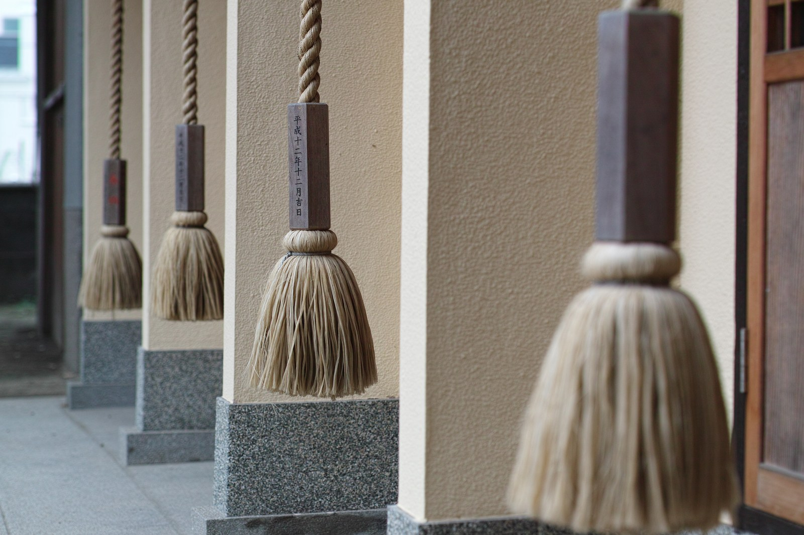

# 神社铃绪（参拜铃）

<!-- 来源：CC BY-SA 2.0 | https://commons.wikimedia.org/wiki/File:%E9%88%B4%E7%B7%92_(Suzuo)_(14946502606).jpg -->

## 概述

神社铃绪是**神道公开参拜礼仪中的铃与铃绳（A）**：拝殿前常设赛钱箱与铃绳，赛钱后若有铃绳可轻摇再礼，铃声在神社本厅英文导览中被表述为有助清净／表敬的一环，随后行二拜二拍手一拜。国学院 EOS《参拝作法》条目说明战后普及的 2-2-1 为通行标准，并指出历史上存在地方与古式差异。完整参拜（手水、鸟居礼、玉串等）见 `shinto.md`；本卡**聚焦铃绪这一物件与「轻摇一声」的短互动**。夏日檐下的风铃（`furin-wind-chime.md`）是另一物件，勿与社殿铃绪混并。

## 核心观念（祈福 / 功德 / 祈祷如何被理解）

铃绪的心意是**在问候神明之前，先以一声铃响收拾心神**：它不是闯关音效，也不是「摇得越响越灵」。神社本厅将投赛钱与摇铃放在礼敬动作之前，强调参拜是问候与报告，愿望可陈说却不宜简化为投币买效果。无铃的神社不强行补摇——有铃才摇，是对现场的尊重。

## 典型仪式

### 1. 赛钱后轻摇铃绪（概念层）
- **场合**：日常参拜、初诣等；拝殿／社殿前方。
- **主要步骤（概念层）**：至拝殿前；投赛钱（自愿）；**若有铃绳则轻摇**；再依通行礼行二拜、二拍手、一拜（细节与古式差异见 `shinto.md`／EOS）。无铃则跳过摇铃，直接行礼。
- **物品**：铃、铃绪（铃绳）；赛钱。
- **谁来举行**：信众与访客；正式祭祀另由神职主持（本卡不涉）。

## 日常与节庆

铃绪属于**参拜当下**的短动作，不是独立节庆，也不作每日居家课诵。正月初诣人潮中铃声最密，但逻辑与平日相同。无铃神社、古式拍手数等差异以各社与 EOS 叙述为准，本卡不统一强加。

## 注意与尊重

无铃不强行；不模仿神乐铃或秘祭乐舞。铃声一次即可，不做「连摇刷分」。与风铃分物件、分语境。摄影与禁地遵守各社告示。

## 手机互动适合度（Three.js 评估草稿）

- **档位：** C 可做致敬小品（非真仪）
- **敏感度：** 低
- **判断：** 「上拉铃绪→一声暖铃→简化鞠躬拍手」手感清晰，可与木鱼敲击声线成对但物件不同。
- **若做成互动：** 手机手势练习（致敬小品，非神社正式参拜）：

1. 奶油色拝殿前，一根铃绪垂着。
2. 上拉一次，铃声短而暖。
3. 轻轻两鞠躬、两拍掌、再一鞠躬（简化示意）。
4. 界面标题用原创名如「庭前一铃」，留一句：问安。
- **红线：** 不模仿神乐秘仪；不设摇铃通关／连击得分；不称完成正式参拝；无铃场景提供「直接一礼」分支；不做功德计数。
- **评估状态：** 待后期统一评估

## 参考来源

- https://www.jinjahoncho.or.jp/en/at-a-jinja/entering/
- https://d-museum.kokugakuin.ac.jp/eos/detail/?id=9055
