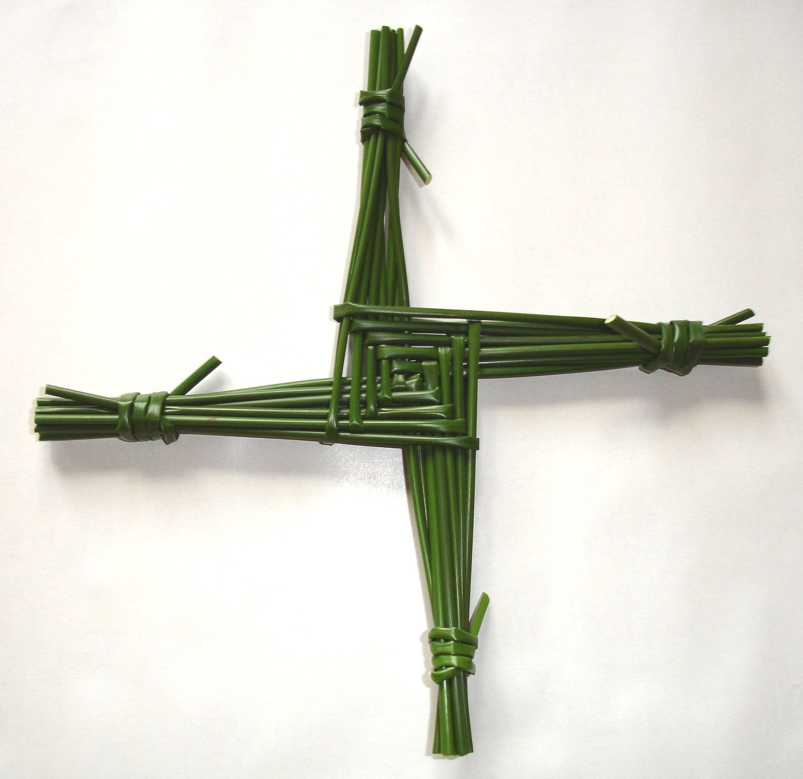

# 圣布里吉德十字（St Brigid's Cross）

<!-- 来源：CC BY 3.0 | https://commons.wikimedia.org/wiki/File:Saint_Brigid%27s_cross.jpg -->

## 概述

圣布里吉德十字（爱尔兰语 **Cros Bhríde**）是**爱尔兰民俗—天主教（A）**的编织护佑物：多在 **1 月 31 日圣布里吉德夜**（2 月 1 日瞻礼前夕）以灯心草、麦秆等草茎编成，洒圣水后悬挂于住宅与畜棚，求家宅与牲畜得护佑（爱尔兰国家博物馆民俗馆藏 NMI Folklife 的宗教与历法习俗记述）。馆藏呈现其样式并非单一：**四臂、菱形、轮形、交织**等多种变体并存，反映地方与家户的编织差异。`celtic-folk.md` 已在岁时概念层点名此物，本卡**聚焦编织物件本身**；圣井与朝圣层另见 `irish-folk-catholic.md`。当代亦有从 Imbolc 出发的新异教重建叙述，与民俗—天主教的编织实践**须分述**，不得混写为「复活的古代真仪」。

## 核心观念（祈福 / 功德 / 祈祷如何被理解）

圣布里吉德十字的心意是**把护佑「编」进门**：圣布里吉德夜编一只新十字、挂上门楣与畜棚，是欢迎圣人与祝福进入家屋的年度姿态。草茎在指间折绕的过程本身就是敬礼的时刻——不需要圣职人员，没有功德计量，也没有灵验结算，挂上即表达完成。洒圣水在民俗叙述中出现，属家庭层面的祝福记号（本卡仅作概念提示，不涉圣事操作）。它的叙事是「家宅蒙护佑」的朴素心愿，不是护身符交易。

## 典型仪式

### 1. 圣布里吉德夜编十字（概念层）
- **场合**：1 月 31 日圣布里吉德夜（瞻礼前夕）；家庭。
- **主要步骤（概念层）**：备灯心草或麦秆；依地方样式折编成十字（四臂、菱形、轮形等变体不一）；民俗叙述中有洒圣水的环节（概念提示）；悬挂于宅内与畜棚。旧十字的更换与处理各地不一，本卡不设通则（**待核实**）。
- **物品**：灯心草／麦秆等草茎。
- **谁来举行**：家庭成员；无圣职人员要求。

## 日常与节庆

圣布里吉德十字是**强季节（圣布里吉德夜／瞻礼前后）**实践：一年一编，此后作为护佑挂饰留存，来年再编新十字。平日不作每日环节，也无课诵式安排。样式与伴俗在民俗档案中地方差异大，本卡以 NMI Folklife 馆藏叙述为准，不展开地方断代（**待核实**）。Imbolc 与四季节点的新异教重建辨析见 `celtic-folk.md`，与本卡的民俗—天主教编织层分开叙述。

## 注意与尊重

标明民俗—天主教身份：不写成凯尔特异教古礼，也不并入当代新异教重建的 Imbolc 仪式。圣人符号不做嘲讽皮肤；圣水仅作概念提示，不模拟圣事。尊重爱尔兰语名称 Cros Bhríde 的拼写。现实编织取用草料应守地方规范；探访民俗藏品与圣地遵守馆方与现场指引。

## 手机互动适合度（Three.js 评估草稿）

- **档位：** C 可做致敬小品（非真仪）
- **敏感度：** 中（天主教民间虔诚、圣人符号）
- **判断：** 「折编→悬挂」手势简洁，草茎材质与门楣场景视觉温和；强季节限定与产品节奏契合，非每日练习。
- **若做成互动：** 手机手势练习（致敬小品，非民俗实务）：

1. 圣布里吉德夜的奶油色门楣特写，几束灯心草待编。
2. 指尖依简化的折绕指引，把草茎别绕成一只四臂小十字。
3. 轻轻挂上门楣，一点烛光暖意落在门口。
4. 界面留一句：欢迎护佑进门。
- **红线：** 季节限定，不强制定时通知、不做每日任务催逼；圣人符号不戏谑变形；圣水仅概念提示；不写成新异教重建古礼；不做「护佑值」累积。
- **评估状态：** 待后期统一评估

## 参考来源

- https://www.museum.ie/en-IE/Collections-Research/Folklife-Collections/Folklife-Collections-List-(1)/Religion-and-Calendar-Customs/St-Brigid-s-Crosses
- https://www.museum.ie/en-IE/Collections-Research/Collection/Top-things-to-see-in-the-Irish-Folklife-Collection/Artefact/St-Brigid-s-Cross/0385e3ce-ebe8-455a-94ec-4d6a8aa684ff
