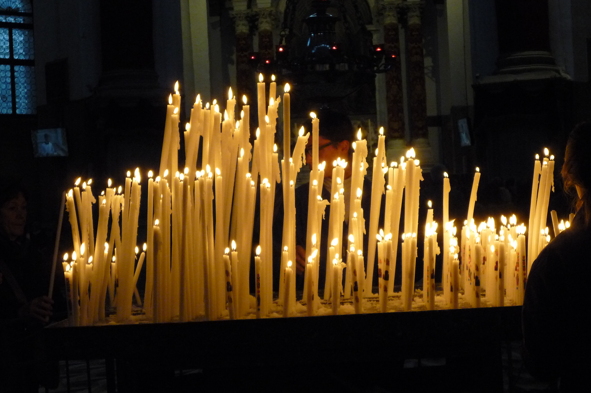

# 天主教还愿烛（votive candle）

<!-- 来源：CC BY-SA 3.0 | https://commons.wikimedia.org/wiki/File:Candles_at_the_Basilica_della_Salute_in_Venice.JPG -->

## 概述

还愿烛（votive candle；亦称献烛）是**天主教民间虔诚中「点一盏小烛、留一个意向」的实践（A）**：在圣像或烛架前点烛，人离开后烛火继续燃着，被理解为祈祷持续呈上的可见记号；堂区科普引《若望福音》「我是世界之光」，并追溯至圣所长明灯与圣人墓前燃灯的旧例。教廷《民间虔诚与礼仪指南》（*Directory on Popular Piety and the Liturgy*，2001）把民间虔诚置于礼仪之下——它导向礼仪、从礼仪流出，**不能替代圣事**。`christianity.md` 已在概念层述及点烛奉献；本卡**聚焦还愿烛物件与「点一盏、留一愿」的短互动**。它与意大利绘牌 ex-voto（`italian-ex-voto.md`）、墨西哥 milagros（`milagros.md`）同属「还愿可见记号」的大家族而**物件各异**，产品须分皮肤；也不与佛教供灯共用「圣火」类特效包（见 `specs/notes-wish-lamps-disambiguation.md`）。

## 核心观念（祈福 / 功德 / 祈祷如何被理解）

还愿烛的心意是**让祈祷「留在那里继续」**：点烛的人写下或默存「为谁、为何」的意向——为病者代祷、为得脱感恩、为亡者祈安——然后离开；摇曳的烛火代替在场的自己，把这份意向继续呈上。奉献是自愿捐献，不是「烛价」，更不是购买恩宠——烛本身没有功效保证、没有功德计量，恩宠在天主教理解中源于上帝而非交易。民间虔诚的位置也须摆正：点烛是日常敬礼的表达，**从属于、而不能替代**礼仪与圣事。

## 典型仪式

### 1. 点烛留意向（概念层）
- **场合**：教堂圣像、烛架或祭台前；朝圣、代祷、还愿谢恩、为亡者祈愿的时刻。
- **主要步骤（概念层）**：在烛架取一小烛（或按堂区惯例点亮电子烛）；在心中或意向卡写下「为谁／为何」；点亮、安放，停留片刻默祷后离开，让烛火留在原处。实地须遵守堂区烛架与捐献规范。
- **物品**：小烛／电子烛、烛架；常配意向簿或意向卡。
- **谁来举行**：信众个人；无圣职人员要求。

## 日常与节庆

点烛是**高日常、低节历刚性**的民间虔诚：堂区烛架平日与主日皆开放，随个人意向随时可行，也常见于朝圣与亡者纪念时刻；常明的烛架让圣所成为代祷的可见档案。本卡不铺陈地方圣所谱系与瞻礼日程差异（**待核实**），天主教整体语境见 `christianity.md`。

## 注意与尊重

点烛是民间虔诚而非圣事，叙述不得写成「完成礼仪」或「蒙恩保证」。奉献表述用「自愿捐献」，禁用「买到恩宠」类交易话语。现实中遵守各堂区烛架与安全规范（电子烛亦是通行做法）；不触碰、不打扰他人点燃的烛与意向。与 ex-voto 绘牌、milagros 小符是同族不同物，与佛教供灯更是不同传统的光明语言——名称与视觉皮肤均须分开。

## 手机互动适合度（Three.js 评估草稿）

- **档位：** C 可做致敬小品（非真仪）
- **敏感度：** 中（天主教民间虔诚、代祷与亡者叙事）
- **判断：** 「点一盏→留一愿→烛火轻摇」手势约 30 秒，与绘牌的画框、milagros 的金属小符视觉错开，可做还愿家族中的独立烛光皮肤；与佛教供灯须分两套视觉。
- **若做成互动：** 手机手势练习（致敬小品，非圣地实务）：

1. 一面奶油暖色的堂区小烛架，几支小烛待点。
2. 指尖轻按，点亮其中一盏。
3. 写下短短的意向：为谁、为何。
4. 烛火轻轻摇曳，界面留一句：它会在这里替你亮一会儿。
- **红线：** 忌「买到恩宠」「神迹达成」类反馈；不写「已完成奉献／礼仪」；不做功德计数；不复刻特定圣所圣像外观；不与佛教供灯共用「圣火」特效包；亡者与病者叙事庄重。
- **评估状态：** 待后期统一评估

## 参考来源

- https://www.vatican.va/roman_curia/congregations/ccdds/documents/rc_con_ccdds_doc_20020513_vers-direttorio_en.html
- https://www.saintpats.org/parish/catholics-light-votive-candles/
