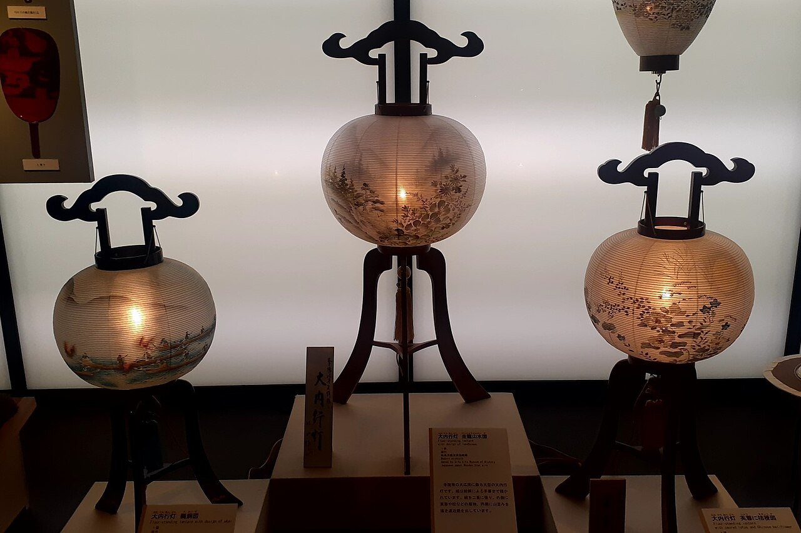
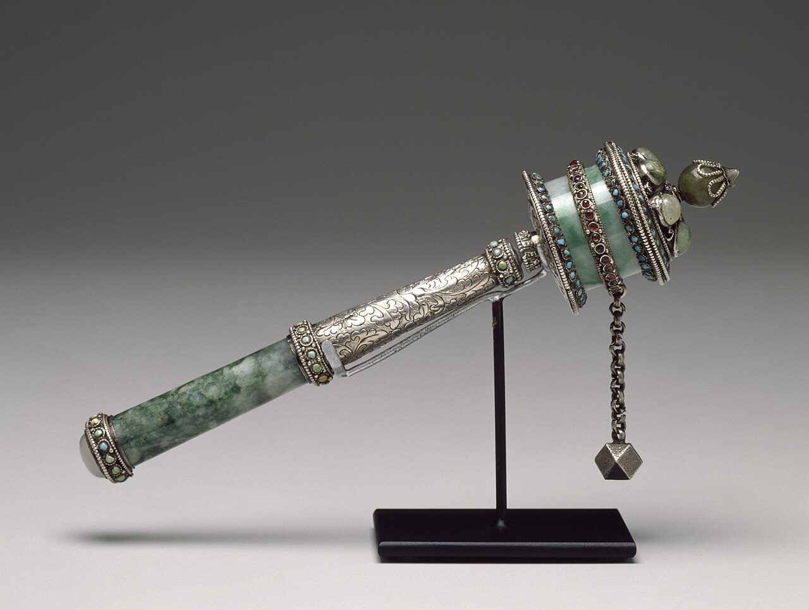

# 五个待实现场景：图片参考册

核对日期：2026-10-01。配套文字见 [五场景考据](../../specs/2026-10-01-five-scene-research.md)。本目录收录 **10 张可本地查看的参考图，每场景 2 张**；逐图原始地址、下载地址、作者、许可、尺寸及 SHA-256 见 [sources.json](sources.json)。

这是建模与交互设计资料，不代表已经实现 Three.js 场景。照片呈现某个具体对象或当代活动，不自动证明古代起源、通行礼仪或宗教效力。下文“观察／建模参考”是对图像的视觉分析，“产品取舍”是设计建议，两者均不冒充历史事实。

## 1. 折一只纸鹤 `crane`

### 成品轮廓与纸张折面

- **署名与来源：** Laitche，[Cranes made by Origami paper.jpg](https://commons.wikimedia.org/wiki/File:Cranes_made_by_Origami_paper.jpg)，2007；作者声明公有领域（[许可说明](https://commons.wikimedia.org/wiki/File:Cranes_made_by_Origami_paper.jpg#Licensing)）。
- **观察／建模参考：** 薄纸形成三角翼、尖尾和折返的头颈；局部有叠层与锐利折线。避免把纸鹤做成圆润实心鸟。花纹只用于观察折面，不是需要照搬的产品贴图。

### 折叠过程

- **署名与来源：** Origamidesigner，[Tsuru wiki.svg](https://commons.wikimedia.org/wiki/File:Tsuru_wiki.svg)，2011；[CC BY 3.0](https://creativecommons.org/licenses/by/3.0/)。本地保存 Commons 提供的 PNG 预览，未改画。
- **观察／建模参考：** 可核对从方纸到鸟形基础、细分颈尾、展开翅膀的连续关系。原图透明底，深色 Markdown 阅读器可能看不清黑字，可在浅色背景查看或打开来源页。
- **产品取舍：** 现有 App 的四次点击是阶段摘要，不是完整折纸教程。未来动画若压缩步骤，应明确是“折纸意象练习”；不要让材料凭空增减。配色仍参考原 [rituals.png](../../assets/reference-ui/rituals.png) 的绿色纸鹤。

## 2. 点一盏心愿灯 `lantern`

### 岐阜市历史博物馆：提灯展品

- **署名与来源：** Asturio Cantabrio，[Gifu Paper Lanterns ac (2).jpg](https://commons.wikimedia.org/wiki/File:Gifu_Paper_Lanterns_ac_(2).jpg)，2022-04，日本岐阜；[CC BY-SA 4.0](https://creativecommons.org/licenses/by-sa/4.0/)。
- **观察／建模参考：** 灯罩周向细筋、纸或丝罩面的柔和透光、上下口与支撑件分离。照片本身不足以确定每件展品的罩面材料，具体材料以馆方文字为准。

### 长良川手工町家 CASA：现代纸灯

- **署名与来源：** Asturio Cantabrio，[Gifu Paper Lanterns 2022-05 ac (1).jpg](https://commons.wikimedia.org/wiki/File:Gifu_Paper_Lanterns_2022-05_ac_(1).jpg)，2022-05，日本岐阜；[CC BY-SA 4.0](https://creativecommons.org/licenses/by-sa/4.0/)。
- **观察／建模参考：** 观察纸面散射、骨架投影和灯芯附近亮度变化；这是现代灯具展示，不作为古代仪式证据，也不要求复制其中灯具造型。
- **产品取舍：** 主造型继续遵循用户原 [wishes.png](../../assets/reference-ui/wishes.png)：暖黄灯笼、木架、心愿牌。新增图片只补材料与结构。心愿牌和点灯流程属于 App 原创，不称岐阜传统祈愿仪轨；也不套用天灯放飞、河灯漂流或韩国燃灯会叙事。

## 3. 庭前一礼 `shinto-torii`

### 京都伏见稻荷大社：鸟居通道

- **署名与来源：** Basile Morin，[Torii path with lantern at Fushimi Inari Taisha Shrine, Kyoto, Japan.jpg](https://commons.wikimedia.org/wiki/File:Torii_path_with_lantern_at_Fushimi_Inari_Taisha_Shrine,_Kyoto,_Japan.jpg)，2019-06-10；[CC BY-SA 4.0](https://creativecommons.org/licenses/by-sa/4.0/)。
- **观察／建模参考：** 圆柱、横梁、黑色柱脚与朱色表面形成强烈重复节奏，步道提供尺度参照。照片是通道内透视，无法确定独立鸟居的完整正立面与顶部曲率，不能当工程三视图。

### 东京明治神宫：绘马形制

- **署名与来源：** Oren Rozen，[Japan 270316 Meiji Ema 01.jpg](https://commons.wikimedia.org/wiki/File:Japan_270316_Meiji_Ema_01.jpg)，2016-03-27；[CC BY-SA 4.0](https://creativecommons.org/licenses/by-sa/4.0/)。
- **观察／建模参考：** 浅色薄木板、双孔、细绳、顶部轮廓和叠挂关系。愿文、姓名、社纹和印章不是产品默认纹理；产品使用自己的文字和明确原创的标识。
- **产品取舍：** 两图来自不同神社，仅用于拆分研究鸟居与绘马，不能声称复原某一神社庭院。通行参拜说明与地方差异见考据；绘马含义另有 [日本观光厅明治神宫解说](https://www.mlit.go.jp/tagengo-db/en/H30-00534.html)。

## 4. 廊前轻转 `tibetan-wheel`

### 尼泊尔 Swayambhunath：固定转经筒

- **署名与来源：** Markus Koljonen（Dilaudid）；当前文件含 Fountain Posters 于 2012 年的提亮修订。[Swayambhunath prayer wheels.jpg](https://commons.wikimedia.org/wiki/File:Swayambhunath_prayer_wheels.jpg)；[CC BY-SA 3.0](https://creativecommons.org/licenses/by-sa/3.0/)。来源说明日期为 2008-06-22，EXIF 为 2008-05-08，保留差异，不断言精确拍摄日。
- **观察／建模参考：** 筒身围绕竖轴旋转，上下支承固定；筒间留出转动空间。局部运动模糊可帮助研究速度层次，但静态照片不能证明旋转方向。
- **使用边界：** 这是尼泊尔实景，仅作固定筒排布与材质参照，不能标成西藏某寺。文字不能从模糊照片临摹、镜像或随意生成；若未完成文字校对，用无经文的抽象练习版本并标明产品改编。

### Walters 藏品：手持结构对照

- **署名与来源：** Walters Art Museum，藏品 **57.2285**，[照片与馆藏说明](https://commons.wikimedia.org/wiki/File:Tibetan_-_Portable_Prayer_Wheel_-_Walters_572285_-_Profile.jpg)，[馆方藏品页](https://art.thewalters.org/detail/21538)。
- **授权：** 器物属于公有领域，**这张三维器物照片采用 [CC BY-SA 3.0](https://creativecommons.org/licenses/by-sa/3.0/)**。不能照抄 Commons API 中只描述器物的 `Public domain` 摘要。
- **年代与地域：** 页面目录标为 17 世纪，但说明明确表示产地及断代难以确定，藏地／蒙古均带问号；不要写成确定的“17 世纪西藏标准转经筒”。
- **观察／建模参考：** 筒身、轴、手柄、链坠是不同部件。链坠属于本件手持结构，不能直接装到所有固定廊筒上；图中黑色托架是博物馆展示支架。
- **产品取舍：** 先选固定廊筒类型，旋转方向按对应传统文字来源核实；不把完成转数显示成念诵或功德的真实完成量。

## 5. 火边花环 `slavic-wreath`

### 乌克兰赫梅利尼茨基：库帕拉节花冠

- **署名与来源：** Alina Vozna，[Ivan Kupala Day in Khmelnytskyi, Ukraine. Photo 135.jpg](https://commons.wikimedia.org/wiki/File:Ivan_Kupala_Day_in_Khmelnytskyi,_Ukraine._Photo_135.jpg)，2015-07-06，舍甫琴科广场；[CC BY-SA 4.0](https://creativecommons.org/licenses/by-sa/4.0/)。
- **观察／建模参考：** 花叶沿环分布，外缘不规则，花朵有高低与朝向变化。这里只能看到佩戴中的花冠，不能从此图推出水上漂放步骤或沉浮寓意；人物与服饰不纳入本次模型设计。

### 白俄罗斯：库帕拉节夜间火光

- **署名与来源：** CenterOfCrafts，[Kupala night bonfire.jpg](https://commons.wikimedia.org/wiki/File:Kupala_night_bonfire.jpg)，2020-06-21，白俄罗斯（具体地点未核实）；[CC BY-SA 4.0](https://creativecommons.org/licenses/by-sa/4.0/)。
- **观察／建模参考：** 暖色火芯、火星、蓝色暮空与人物剪影的亮暗对比。该图仅补灯光参考，不证明乌克兰或波兰的习俗；不据照片设计真人跃火教程。
- **产品取舍：** 考据按乌克兰 Kupala、波兰 Sobótki 分别展开；此处白俄罗斯照片另列。场景若综合花环与火光，必须标为当代产品改编。漂放花环的依据须读文字来源，不能从佩戴花冠的照片自行推演。

## 资料用途与授权记录

- 10 张本地图全部来自有署名与许可页的 Wikimedia Commons 文件。每张只下载服务器预览（小图保留原尺寸），没有本地裁切、改色或生成内容；SVG 折叠图使用服务器渲染的 PNG。来源文件先前的修订仍保留。
- 各图使用自身列出的许可，**不随仓库其他内容统一改为 CC BY 4.0**。复用时保留作者、来源链接、许可链接及修改说明；CC BY-SA 图片的改编须遵守其相同方式共享条件。图片获准使用不意味着机构或人物为 App 背书。
- 原有两张 UI 图继续按 [assets/README.md](../../assets/README.md) 的来源说明管理，未替它们推定开放授权。本目录不复制它们，直接链接原文件。
- 这些资料留在 `design/`，不进入 App 运行时资源包。以后制作模型可参考可见结构，但本次照片不提供完整三视图，也未补出被遮挡的结构；进入具体建模时仍需选定主样与尺度。
