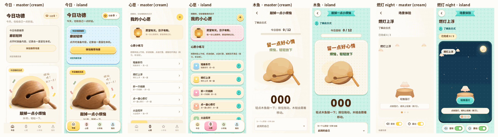

# 实验：动森 / animal-island「小岛」壳层预览

分支 `experiment/animal-crossing-shell`，只做视觉预览，用来和 master 的奶油风并排比较，**不打算合并**。参考库是 animal-island-ui，只移植了 token 和 CSS 写法，没有把它作为依赖引入。



## 改了什么

- `packages/app/src/style.css`：`:root` 改成小岛 token，所有规则改用这些 token。
  - 底：薄荷页面加两层波点。
  - 面板：沙色 HUD 面板，有粗软白边、细描边、内高光和实心台阶。
  - 按钮：糖果色按压按钮。按下时面板沉进台阶，`translateY` 加上缩短的台阶阴影。只有可点的元素有台阶，只读计数（场景进度、珍藏数）是平的。
  - 主按钮改成薄荷色，次按钮奶油黄。另有桃、天蓝、泡泡糖粉、叶绿四种强调色，每色分 face / hi / ledge / tint 四档。
  - 底部导航：浮起的 HUD dock，四个 tab 各配一色（今日黄、心愿粉、小天地绿、我的蓝）。
  - 组件：顶栏标题改为燕尾飘带；分段筛选；小岛开关（凹槽轨道，开启为叶绿）；圆角方形勾选单选框；小天地改成岛屋（波点墙纸、天窗、木地板、圆地毯）。
  - 字体：只用系统圆体字体栈 `Nunito, Varela Round, M PLUS Rounded 1c, Yuanti SC, HarmonyOS Sans SC, PingFang SC, Blessing Sans…`，没有新增网络字体。
- `packages/app/src/scene-experience.tsx`：场景舞台加了一个属性 `data-scene={entry.id}`，只作样式钩子（夜间舞台用），不涉及逻辑。
- `apps/cyber-bless/index.html`：`theme-color` 改为薄荷 `#cdf1e6`。
- 没有改动的部分：业务逻辑、路由、四个 tab、全部中文文案、`assertSafeCopy`，以及所有 Three.js 场景代码（几何、纸鹤折叠运动学、灯光、相机）。

## Token 对照（旧奶油 → 新小岛）

旧 token 名都保留为别名（`--cream`、`--line`、`--yellow`、`--green`），不会有规则解析为空值。

| 旧 token | 旧值 | 新 token | 新值 | 说明 |
| --- | --- | --- | --- | --- |
| `--cream`（页面底） | `#fcf8ef` + 4px 细点 | `--island` + `--dots` | `#cdf1e6`，点 `#b3e7d9` 和白点 | `--cream` 现在等于 `var(--island)` |
| 卡片底（多处字面量 `#fffcf7bb`…） | — | `--sand` / `--art-paper` | `#fbf3dc` / `#fdf8ee` | HUD 面板；插画所在面板用插画本身的纸色 |
| `--paper` | `#fffcf6` | `--paper` | `#fffcf2` | 输入框、chip、dock |
| `--line` | `#eee3d1` | `--edge`，外加粗边 `--rim` | `#ecdcb8` / `#fffdf7` | 细描边加粗软边 |
| —（卡片阴影） | `0 3px 7px #ad86530d` | `--ledge`、`--panel-shadow` | `#a2d9ca` 实心台阶 | 面板落在薄荷底上的台阶 |
| `--ink` | `#361b0e`（15:1） | `--ink` | `#4a2a12`（薄荷上 10.6:1） | 标题，暖棕，不用纯黑 |
| `--muted` | `#897767`（奶油上 4.0:1，不达 AA） | `--ink-soft` / `--muted` | `#6b4a2b`（≥5.8:1）/ `#7a5f45`（≥4.8:1） | 页面和波点面板里的字用 `--ink-soft`，`--muted` 只用在实底面板内 |
| 底栏未选中字 | `#ae9c88`（2.5:1） | `--muted` | `#7a5f45`（paper 上 5.8:1） | |
| `--yellow` | `#ffda4a` | `--butter`（hi / ledge / tint） | `#ffd966` / `#e0aa25` 台阶 | 次按钮、tag、计数 |
| 主按钮黄渐变 | `#ffe77a → #ffda4a` | `--mint-hi → --mint`，台阶 `--mint-ledge` | `#86e8dc → #4fd8c9`，`#17a093` | 主色改为薄荷，字色 `--mint-ink #064a43`（≥5.8:1） |
| `--green` | `#879d6b` | `--leaf` / `--leaf-ledge` | `#8fd17a` / `#5aa548` | 开关开启、完成点 |
| focus | `#a37938` | `--focus` | `#0b6e66` | 薄荷底、沙色底上都 ≥3:1 |
| — | — | `--peach` `--sky` `--bubblegum`（各 4 档） | `#ffb08f` `#8fd0f5` `#ff9fb8` | 糖果强调色 |
| — | — | `--mint-text` | `#0a5f58` | 文字链接，压在波点上也有 5.5:1 |
| — | — | `--night` `--night-low` `--star` `--moon` | `#11304a` `#1b4d58` … | 夜间舞台 |

## 场景舞台的折中

C 级场景的画布是透明的（`setClearColor(0, 0)`），舞台底色就是它们的背景。灯光（`addCelLights` 的暖色天光和地反射）按奶油底调过。场景代码一行没改，只改了画布外的舞台和叠层。

- **白天舞台**（纸鹤、鸟居、转经、花环、短册、风铃）：舞台从浅天蓝渐变到暖沙色，铺白色小波点，外框是 HUD 粗边。物体所在的下半部分仍是暖底，暖色布光和墨线不会跑偏。薄荷波点只出现在舞台外的页面上，不直接衬在物体后面。
- **夜间舞台**（点一盏心愿灯 `lantern`、燃灯上浮 `yeondeunghoe`，master 上原本是奶油底）：深青蓝渐变，加星点、底部海光和一轮月亮。月亮是伪元素，`z-index: -1`，在画布后面。**折中之处**：物体仍是白天的暖光，没有做真正的夜景布光，因为那要改场景灯光。灯笼和莲灯本身会发光，放在夜里成立；木架偏亮，像被灯照着，略不写实。
- **叠层**：标题、提示、按钮、步骤点、愿望输入都改成自带底色的 HUD 件（名牌、对话气泡、薄荷按压按钮、糖果点），白天、夜间和旧暗场景上都可读。
- **HUD 托盘**（审计 P1-4）：App 的场景舞台 `.library-scene-stage` 分成「画布 + 底部沙色托盘」。画布高 `min(65vh, 540px) − 132px`（≤360px 时托盘 150px），提示、步骤点和动作按钮都放在托盘里，不再压住主体或要拖动的对象（心愿灯的木牌）。愿望框打开时托盘向下长高 80px（`:has()`），画布尺寸不变，提示和「练习，非法效」说明仍然可见。舞台名牌在 App 里隐藏，因为页内 H1 就在舞台上方。没有托盘的宿主（`/dev/scene`）保持原来的画布叠层。
- **旧暗场景**（泉边一念、花水位一倾）自带不透明的夜色画布，这里只改了叠层，顺带修好了 master 上「暗底暗字」的问题。
- **木鱼**：3D 木鱼放在和插画同色的纸色舞台面板里（带小点），保留暖底。

## 测试与无障碍

- `style.test.ts` **没有修改**。它只断言行为：44px 触控、16px 输入框、加载错误换行、叠层的 pointer-events，不检查旧 token 的值；新样式全部满足。`assertSafeCopy` 和其他文案测试也没有动。
- AA：运行时逐个检查可见文字，取「实底、渐变色标、波点」里最差的一档计算对比度。390px 下 12 个状态（四个 tab、场景目录、资源缓存、仪式时光、木鱼、2D 纸鹤、白天和夜间舞台、新建心愿）加桌面今日，全部达到 AA。
- `prefers-reduced-motion` 和应用内「减少动态效果」仍会关掉所有过渡和动画，按压变成瞬时，台阶效果保留。
- 用真实指针点击验证了纸鹤（9 次点击走完折叠、托起、写愿望，到 3/3）和心愿灯的动作按钮：按钮始终在最上层，场景照常推进。

## 已知缺口

- **圆体中文**：只用系统字体。Nunito / Varela Round 只在装了的设备上生效（截图机装了，所以数字和拉丁字母是圆体）；没有系统圆体时中文落到 PingFang 或内置 Blessing Sans（思源黑体），不是圆体。要稳定的圆体需要打包字体，本次没有做。
- **插画素材**是奶油底位图裁切（`.art` 做了隔离，`multiply` 不会和底混合）。目前靠插画同色纸底、明信片相框和道具格子遮掩；放到糖果色上必须加格子。
- **场景布光**：夜间舞台上的物体还是白天的暖光，真正的夜景要在场景侧调灯光参数。
- ~~今日小练习的 emoji 字形~~：已改为手绘场景图标（`packages/app/src/scene-icons.tsx`，按场景 id 取图，三渲二平涂加墨线），放进和插画裁切同尺寸的 76px 道具格；文案对象不再带图标。
- Expo 原生外壳（`apps/mobile-expo/App.tsx`）的加载底色仍是奶油 `#faf6ec`，`/dev` 工具页（`apps/cyber-bless/src/styles.css`）也没有改。
- 没有验证：真机、读屏软件、系统高对比度模式。截图用的是 SwiftShader 软件渲染，Three.js 画面以真机为准。

## 如何对比

```sh
# 小岛风（本分支）
git switch experiment/animal-crossing-shell
npm run dev -- --port 5310 --strictPort

# 奶油风（master），另开一个 worktree 并排看
git worktree add ../wbr-master master
cd ../wbr-master && npm ci && npm run dev -- --port 5311 --strictPort
```

截图（headless Chrome + SwiftShader，390×844 @2x，桌面 1280×800）只保存在本地 `/workspace/toon-shots/`，没有提交。`acnh-before-*` 拍摄于改动之前，`acnh-after-*` 是同样的状态：

| 状态 | 文件后缀 |
| --- | --- |
| 今日（顶部 / 滚到底） | `01-today` / `01b-today-scrolled` |
| 心愿（顶部 / 滚到底） | `02-wishes` / `02b-wishes-scrolled` |
| 小天地 | `03-world` |
| 我的（顶部 / 滚到底） | `04-me` / `04b-me-scrolled` |
| 木鱼仪式 | `05-ritual-woodfish` |
| 纸鹤场景（白天舞台） | `06-scene-crane` |
| 燃灯上浮（夜间舞台） | `07-night-yeondeunghoe` / `07b-…-scrolled` |
| 点一盏心愿灯（夜间舞台） | `08-night-lantern` |
| 桌面今日 | `09-desktop-today` |

`acnh-after-10…18` 是额外的检查截图：新建心愿、心愿详情、2D 心愿灯仪式、完成页、场景目录、泉边一念暗场景、纸鹤折完和写愿望两步、心愿灯夜间的两步。截图时隐藏了开发环境的 SHADER LAB 调试入口，它不属于壳层。
