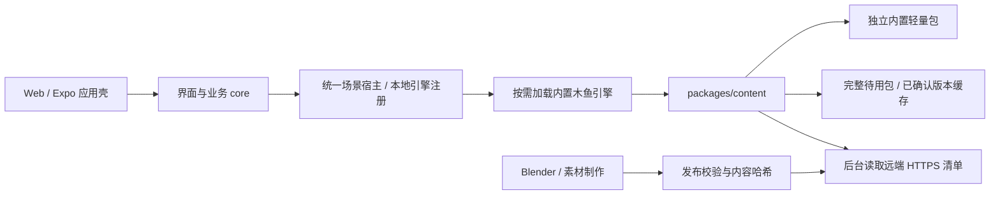

# 场景内容分发

木鱼已接入「小应用壳 + 内置交互引擎 + 独立版本内容包」。保留 Expo SDK 54、React DOM、Three.js、anime.js；制作素材不再整个复制到网页发布目录。构建脚本需要 Node.js 22.18+，以便发布工具和运行时共用 TypeScript 校验器。

## 模块与更新边界



| 位置 | 职责 |
| --- | --- |
| `packages/core` / `packages/runtime` | 记录、进度、奖励、串行保存，不接触下载缓存 |
| `packages/scene-runtime` | 通用懒加载宿主、暂停/恢复、页面可见性、取消与幂等释放 |
| `packages/app/src/scene-engines.ts` | 本地引擎注册表，保留每个引擎的上下文和控制器类型 |
| `packages/app/src/woodfish-*` | 触控、anime.js、接触约束、渲染和资源释放 |
| `packages/content` | schema、兼容性、SHA-256、候选选择、确认/回退、Web 缓存与桥接接口 |
| `apps/mobile-expo/scene-cache.ts` | 原生下载、流式哈希、文件移动、缓存预算与取消 |
| `content/woodfish/pack.json` | 远端木鱼配置 |
| `content/woodfish/bundled.json` | 与内置 GLB 一起维护的独立配置，远端发布不能改写它 |
| `scripts/publish-scene-content.mjs` | 校验、哈希资源、不可变版本清单、频道清单 |
| `scripts/prepare-app-assets.mjs` | 从同一显式清单生成 Web / Expo public |

首个契约是 `sceneId: woodfish` / `engine: woodfish@1`。可更新模型及内嵌贴图、可选短音效、操作提示、节点绑定、槌头半径/握点、灯光强度/曝光、已有动作的阶段时长。包不能执行 JS/HTML，不能改变目标步数、奖励或存档。模型必须保持该引擎的坐标、朝向、槌头原点与接触区域约定；新的玩法、坐标体系或解码器需要更新引擎代码。

木鱼包还可在顶层选择画布渲染风格，例如 `"renderStyle": "toon-ink"`。配置片段：

```json
{
  "sceneId": "woodfish",
  "engine": "woodfish@1",
  "renderStyle": "toon-ink"
}
```

可选 ID 仅有 `original`、`toon-ink`、`toon-soft`；旧包缺少该字段时按 `original` 解析，未知 ID 会被拒绝。`content/woodfish/pack.json` 控制远端包，`content/woodfish/bundled.json` 独立控制离线内置包。仅修改风格也会改变发布指纹，无需改动 GLB；更新仍在后台准备并于下次进入木鱼时试用，当前场景不会中途切换。

当前以一个自包含 GLB 为模型更新单元。只更新声音、文案或参数不会重新下载相同哈希的模型；更新内嵌贴图会产生新 GLB。独立共享纹理依赖图留待后续。

## 加载、缓存与回退

首页不请求场景模型。进入木鱼依次尝试「上次完整准备的待用缓存包 → 最近两个已确认缓存包 → 内置包」，不等待内容服务器，也不在前台重新下载缺失的远端资源。未就绪时显示轻量画面和加载提示，仍可敲击；离开页面取消加载。

首帧成功后才在后台检查远端清单（2.5 秒超时），逐个下载模型与声音，校验字节数/SHA-256、模型依赖、节点、几何与贴图预算。完整写入缓存后登记 `pending`；下载中断、坏包、存储配额不足都不覆盖已确认版本。下一次进入才解码、实际绘制待用包，首帧成功后写入 `confirmed`，保留最近两个已确认描述。旧版数组元数据兼容读取，元数据修改在共享客户端内串行执行。

确定性的内容缺陷会隔离该候选，最多保留八个失败身份；内容变化后可以重试。GPU 等临时初始化错误只回退，下次仍可重试。使用中 GPU 上下文丢失则回到可敲击静态画面，下次进入重试。

挂载期间固定内容版本，下次进入再选择新版。跨重启恢复已有仪式进度，不保证恢复同一个视觉版本；规则仍在 core，所以本轮不迁移存档。

Web 使用独立 IndexedDB `wbr-scene-content-v1`，按哈希保存 ArrayBuffer、小索引管理 LRU；缓存命中只更新小索引，不重写模型二进制。存储不可用时仍可直接使用内置包，后台更新必须成功写入缓存。Native 使用 `Paths.cache/wbr-scene-content-v1`，唯一 `.part` 临时文件下载完成后，每 256 KiB 读取校验，再移动到哈希文件名。原生下载和写入串行；前台只读缓存接口独立于下载队列，不等待正在进行的网络传输。DOM action 仅返回 URI，二进制不以 Base64 跨桥。HTTP 开发页使用 Web 适配器，发布版 `file:` DOM 使用 Native 适配器。

缓存预算 256 MiB，单资源最多 64 MiB，音效最多 4 MiB、解码后不超过 3 秒/双声道，下载超时 20 秒。当前木鱼最多 10 万三角面、12 张内嵌 PNG、单张 2048×2048、总计 16M 像素；暂不接收压缩编码扩展。这些是初始预算，并非真机测试所得。

缓存可以被 LRU、系统或用户清理；已确认的描述不意味着文件永久保留。文件缺失则立即尝试下一个本地候选，后台更新可重新准备远端当前版本。内置原始文件随应用保留，不依赖可淘汰缓存；活动场景持有已解析内存直到退出。缓存与 `cyber-bless:personal:v1` 完全分开，不清理用户记录。

`mountScene()` 统一处理异步引擎加载、加载期间卸载、最新设置转发、页面可见性、暂停/恢复与失败释放。引擎只负责自身渲染、动画和 GPU 资源。宿主的 `AbortSignal` 随卸载/失败终止前后台内容工作；后台返回不能复活已卸载场景。当前接入木鱼，纸鹤和心愿灯仍是原有步骤交互。新增引擎需注册本地代码及对应契约，注册表不加载远端脚本。

## 开发与发布

```powershell
npm install
npm run dev -- --port 5176
npm run content:publish
```

Vite 开发服务提供 `/scene-content/woodfish.json` 和高清哈希资源。修改素材/配置后运行 `content:publish`，进入木鱼触发后台准备，准备完成后再次进入试用新版；不会中途替换正在使用的物理参数。开发内容路由不会进入生产 dist。

生产 Web 配置 `VITE_SCENE_MANIFEST_URL`，Expo 构建配置 `EXPO_PUBLIC_SCENE_MANIFEST_URL`，值为自己 HTTPS 内容源的 `woodfish.json` 地址。不配置则直接使用内置轻量模型。Web 仅允许 localhost 开发使用 HTTP；原生下载要求 HTTPS。本仓库未绑定或部署云服务。

Web / DOM 读取清单需配置 CORS，包括原生 `file:` 页来源。公共无凭据内容可设置 `Access-Control-Allow-Origin: *`。清单使用 `Cache-Control: no-cache`，哈希资源使用 `public, max-age=31536000, immutable`。SHA-256 验证文件与清单一致，清单依赖可信 HTTPS 源，本轮未实现离线签名认证。

1. 更新 `content/woodfish/pack.json` 和高清 GLB。可选音效设置 `$env:WBR_SCENE_SOUND='path/to/hit.wav'`；不设置则用内置合成敲击声。
2. 执行 `npm run content:publish`。脚本校验契约、绑定和预算，输出到忽略的 `artifacts/scene-content/`；版本附加配置指纹，资源使用完整 SHA-256 文件名。
3. 上传新哈希资源及 `releases/<revision>.json`，确认可读后最后替换 `woodfish.json`。
4. 回滚时用保留的旧清单替换 `woodfish.json`。旧哈希资源继续保留，不覆盖同名文件。

内置模型单独用后台 Blender 生成，不修改原 `.blend`：

```powershell
& 'C:/Program Files/Blender Foundation/Blender 5.2/blender.exe' --background --factory-startup --python-exit-code 1 --python scripts/blender/export_bundled_woodfish.py
node scripts/prepare-app-assets.mjs
```

内置模型 1,763,136 字节（1.68 MiB）、21,962 三角面，贴图最多 448px；高清版 7,235,024 字节（6.90 MiB）、93,816 三角面。闭合网格、UV、法线、切线和 PBR 均纳入校验。两个 public 目录是生成输出，不手工放文件；制作图、UV 工作图、`.blend` 和高清包不会进入应用启动素材清单。

## 验证与后续

```powershell
npm run verify
# 另起终端运行 Vite 后：
python scripts/test-scene-content.py
python scripts/test-woodfish-pointer.py
python scripts/test-woodfish-browser.py
```

内容测试覆盖契约、前台只读缓存、两阶段确认/回退、哈希、断网、取消、并发元数据、原生缓存逻辑、LRU 与解码预算。宿主测试覆盖懒加载卸载竞态、设置更新、可见性、失败释放与引擎注册。浏览器覆盖慢清单不阻塞首帧、资源复用、下一次进入才更新文案/灯光/声音、刷新后离线缓存、配额不足、半包取消、错误节点/首次绘制失败回退，以及原鼠标、触屏、音效和奖励流程。

2026-09-21 验证：全仓 76 项单元测试、两档网格/材质检查、Vite 生产构建、Expo Android/iOS 嵌入检查通过。本地优先浏览器测试通过，包括慢清单、缓存配额不足、下载取消和下一次进入更新。另注入了首次 draw 抛错、着色器链接失败并在回退下载期间 resize 两种错误，均恢复到内置 3D。网页 dist 约 11.27 MiB（改造前约 30.77 MiB）；这是发布目录大小，不是首屏下载量。

Expo Android/iOS 嵌入打包不能替代真机验收。发布前仍需测试两端发布版 Native URI、断网重启、磁盘不足、系统清缓存、WebView 重启，以及峰值内存、帧率与触觉。

远端动态场景目录、存档版本快照、用户主动保留离线包、跨场景共享纹理、KTX2/Meshopt、自动质量档、大世界分区流式加载和 EAS Update 留作后续。通用宿主与本地注册表已经具备，内容契约目前仍限木鱼；完整大世界流式加载尚未实现。
