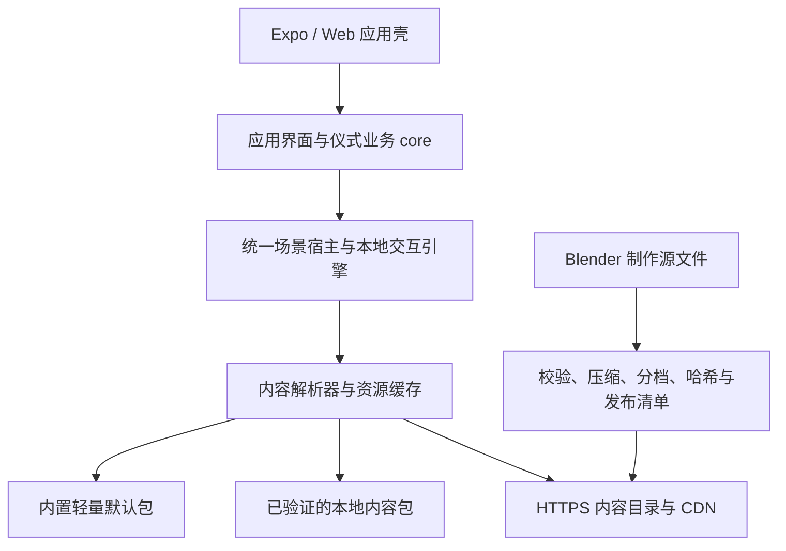

# 大场景与频繁内容更新：框架调整方案

状态：此文保留初始目标架构与后续路线。用户已确认内容更新范围，本轮已实施木鱼内容分发主链路。**当前实现、限制和验证以 [场景内容分发](../../scene-content.md) 为准**。下面的通用场景宿主、动态目录、存档 v2、离线保留、压缩编码与自动档位仍是后续设计，不代表已经完成。

## 目标与默认范围

让场景数量、模型大小和素材更新频率增长时，应用启动、安装体积和既有用户记录不随之失控。保留当前 Expo / React DOM / Three.js / anime.js 技术栈与鼠标、触屏操作。

默认支持独立更新模型、贴图、音效、文案及已有引擎允许的交互参数。新增交互代码通过兼容的应用代码更新发布；新增原生能力需要新二进制构建。下载内容包不执行任意脚本。

不在这一阶段更换三维引擎、建设账号系统、购买云服务或直接部署生产 CDN。离线首次安装保留轻量可玩的默认体验；高清场景按需下载，已缓存版本可以离线重用。下载缓存允许系统或用户清理，心愿与仪式记录不属于缓存。

## 代码检查发现

| 现状 | 增长后带来的问题 | 对应改造 |
| --- | --- | --- |
| `woodfish-scene.ts` 已动态导入 | 代码拆包有效，但不等于模型独立发布 | 保留懒加载，增加内容包解析与资源服务 |
| GLB 固定路径并列入 Expo public 复制清单 | 高清模型跟随安装包，素材更新绑住应用构建 | 安装包仅包含启动资源与轻量默认包 |
| Vite `publicDir` 指向整个 `assets` | 旧材质、独立烘焙图都进入网页构建目录 | 用发布清单生成专用 public 目录 |
| 木鱼 GLB 约 6.90 MiB，木鱼资产目录共约 21.20 MiB | 制作资产多于实际运行资产 | 制作目录和不可变发布目录分离 |
| 当前网页输出目录约 30.77 MiB | 发布目录偏大；这不等于首页会下载全部文件 | 分别统计构建体积、首次请求量、解码内存 |
| 节点名、槌头半径、握点、敲击范围与位置硬编码 | 替换模型尺寸后可能穿模或敲空 | 版本化模型契约和受校验的绑定参数 |
| `RitualId` 与仪式元数据固定在 core | 单纯增加远端目录不能添加新仪式 | 后续增加动态内容 ID 和会话配置快照 |
| 开发图库 `packages/scenes` 与产品木鱼各有自己的生命周期 | 每个新场景重复实现暂停、释放与错误处理 | 统一产品场景宿主，旧图库通过适配迁移 |
| `Session` 未记录内容版本与目标步数快照 | 更新目标步数可能改变进行中的仪式 | 新会话固定规则与内容版本，旧存档做明确迁移 |

## 选择

1. **继续把所有内容内置**：简单且首次离线完整，但每次更新和安装体积随场景增长，不适合目标。
2. **小应用壳 + 内置场景引擎 + 远端版本化内容包（推荐）**：大资源按需交付，保留可靠本地玩法；普通换肤、模型、声音、文案更新无需替换代码。
3. **每个场景都是完整远端网页/脚本**：内容与代码自由更新，但离线启动、业务桥接、兼容性和回滚都复杂；当前需求没有必要先走这条路。

## 模块边界

建议职责分布：

- `packages/core`：心愿、进度、奖励、存档迁移；场景不能自行写入功德或用户记录。
- `packages/scene-runtime`：场景生命周期、加载状态、输入转发、活动/后台状态、渲染预算、音效与 GPU 资源释放。与业务存档解耦。
- `packages/content`：目录与包的 schema、兼容性检查、资源引用、版本选择、下载协调、失败恢复。平台缓存通过接口注入。
- `packages/scenes`：按 `engineId` 注册并懒加载的交互实现；先迁移木鱼，图库保留适配器，不同时重写所有场景。
- Web 缓存适配器：IndexedDB 保存 Blob 与版本元数据，应用自行管理完整性、引用计数和淘汰；HTTP 缓存只作辅助。
- Native 缓存适配器：Expo FileSystem 保存下载文件，通过异步 DOM action 返回 URI 与少量元数据。模型二进制不作为巨大的 Base64 字符串通过 React props 传输。
- `design/`：`.blend`、UV 图、生成候选图、未压缩制作贴图；不自动进入 public。
- `content/`：审阅后的场景描述、模型绑定与发布输入；构建产物按内容哈希输出。

第一阶段不为了目录结构而一次性拆出全部包：先建立实际有两个调用方的契约，再移动实现。全局导航与存档不随资源下载重挂载。

## 三类更新分别处理

| 更新 | 交付途径 | 生效规则 |
| --- | --- | --- |
| 模型、材质、声音、文案、已有动作参数 | 内容目录 + CDN | 下载完整、校验通过，下一次进入场景使用 |
| 新交互、引擎修复、React 界面逻辑 | Web 部署；Native 可引入 EAS Update | 仅分发给兼容 runtimeVersion，空闲/下次启动生效 |
| 新原生依赖或原生权限能力 | 新 Android / iOS 构建 | 升级安装后可用 |

项目目前没有 `expo-updates` 配置。内容服务与 EAS Update 是两条独立通道，不把所有高清场景塞进每次代码 OTA。任何情况下都不在用户敲击、折纸或提交心愿途中强制换包或刷新 WebView。

## 内容契约

一个可发布场景由版本化 manifest 引用一组不可变资源，逻辑上是一个包，不要求下载为单个 ZIP。以哈希寻址复用未改变文件，修改音效不必重下模型。

manifest 必需字段：

- `schemaVersion`、稳定 `sceneId`、不可变 `contentVersion`。
- `engineId` / `engineApiVersion`、必要能力列表；`schema` 版本、交互引擎版本和原生 `runtimeVersion` 分开判断。
- 展示文案、封面、可用质量档；首次只取轻量目录和封面。
- 各资源相对路径、媒体类型、字节数、SHA-256；生产资源来源限制为配置的 HTTPS 发布源，解码器/worker 来自应用控制的运行时。
- 模型坐标与绑定：单位、朝向、节点角色、握点、槌头尺寸、接触区域、放置高度；必须和对应引擎 schema 匹配。
- 受引擎约束的相机、照明、动画/声音参数；不含可执行表达式。
- 仪式规则引用：通过业务层验证的目标步数、收藏物标识等；奖励额度由业务规则掌管。

未知 schema、缺少引擎能力、越界参数、缺失模型节点、无效贴图格式或超过资源预算，均不能成为当前可玩版本。GLB 解析成功还不足够，必须验证引擎所需锚点与几何约束。

## 下载与版本状态

场景状态：`catalogued → downloading → verified → ready`，失败保留旧版；取消和失败可以重试。进度按实际字节显示，未知总量时显示不定进度，不伪造百分比。

1. 启动先读本地目录，展示现有内容；后台轻量检查目录版本/ETag，不阻塞首页。
2. 用户进入未缓存场景时，先显示封面和下载体积；已有版本立即可玩。大包不在移动网络上无提示预下载。
3. 下载到临时区域，逐文件校验长度/哈希；支持取消、有限重试与相同资源请求合并。续传只有在服务器 Range/ETag 支持且能够验证时启用，否则重下该文件。
4. 完整包通过 schema 与资源校验后原子登记为候选版本；首次实例化/首帧成功才标记为可回退的正常版本。
5. 当前会话固定 `sceneId + contentVersion + quality + rulesSnapshot`。新版本在下一次进入时选择，不替换正在播放的材质、碰撞尺寸或目标步数。
6. 解码或运行失败则撤销候选激活、隔离坏版本，恢复上一兼容版本或内置回退。解析错误、hash 不匹配和网络暂时失败需区分，不能永久屏蔽所有下载重试。
7. 内容发布回滚通过切换目录指向已有旧版本完成；保留版本的资源不可覆盖。CDN 上先发布完整资源，最后更新目录指针。

磁盘与 GPU 缓存分开：模型下载在磁盘不代表应常驻显存。默认只有当前场景驻留 GPU，退出即释放材质、纹理、ImageBitmap、阴影图、动画和监听器。缓存按字节限制和 LRU 清理；使用中的包、进行中会话依赖、明确保留离线的包不能静默淘汰。空间不足时报告并允许清理；不删除心愿、记录和收藏。

暂定普通缓存目标为 256 MiB、后台并发下载 2 个文件，均可配置，并应通过真机磁盘压力与网络测试调整；不作为已经测得的最优值。系统仍可能清除可回收缓存，必须能够检测缺失并恢复。

## Expo / WebView 必须先验证的边界

当前 SDK 54 的本地 `expo/src/dom/webview-wrapper.tsx` 打开了文件读取选项，发布版 DOM 使用 `file:` 资源基础路径；开发版 DOM 则来自开发服务器。不能仅凭桌面浏览器通过就宣称原生缓存可用。

首个实现里先做最小真机验证：Native 下载一个测试 GLB → 校验 → action 返回受管理 URI → DOM 的 XHR/GLTFLoader 读取 → 断网重启复用 → 杀死 WebView 后恢复。Android 和 iOS 的发布构建均需验证，开发 HTTP 页面不能被假设能读取任意 file URI。

开发模式可使用 HTTP 源的 Web 适配器；发布模式使用已验证的 Native 文件适配器。不依赖 `file:` 页面中的 Service Worker 实现原生离线缓存，不用“全量 Base64 过桥”掩盖本地 URI 访问问题。如果当前桥接无法满足，先解决受控资源传输适配层，不直接替换整个业务页面。

## 大资源交付与性能

先以每场景一个自包含 GLB 作为迁移单元。只有资源重复率和更新频率证明有收益时，再将模型与共享纹理拆开；此时加载器只能解析 manifest 中已校验的依赖，禁止偷偷回源拉取未声明资源。

提供封面、轻量和高清三档。先完成轻量可玩版本，再按设备能力/用户选择使用高清。KTX2/Basis 和 Meshopt 在离线流水线中生成，解码器随程序本地打包，能力不足时回退兼容资源。压缩下载体积与纹理解码后的显存是两个指标，不能只看 GLB 文件小了多少。

初始目标：默认内置场景包不超过 2 MiB、高清按需、封面不超过 150 KiB、每个档位单独记录三角面数/纹理尺寸/估计显存/解码耗时。这些是待优化验证的目标，不是对现有 6.90 MiB 木鱼直接作出的承诺。影子质量、DPR 和贴图档位作为场景宿主统一策略；静止场景保持按需渲染。

Blender 源文件和历史生成图留在制作区。Vite 与 Expo 都从同一个显式安装包清单产生 public 目录；生产内容清单只带运行资源，CI 禁止 `.blend`、UV 工作图和原始烘焙中间产物混入应用发布目录。

## 会话与存档兼容

不再用会随远端更新变化的目录现值解释历史会话。新存档记录内容版本、引擎版本、目标步数和必要的规则/显示快照；已结束记录可在场景下架后展示。

旧 v1 存档迁移时，将三种现有仪式映射到确定的内置版本与目标值（木鱼 12、纸鹤 4、灯 3），保持进度、幂等奖励、心愿关联与收藏不变。迁移失败保留原始存档供恢复，不清空用户数据。动态新 sceneId 只能选择已存在且兼容的 engineId；远端目录不能凭空引入客户端没有的手势实现。

## 分阶段交付

1. **资源边界与契约**：建立 scene/asset manifest、生成发布清单；制作资产移出运行 public；木鱼用 manifest 解析路径、绑定和参数。先用本地源把行为保持住，补契约测试。
2. **按需加载与版本缓存**：Web IndexedDB + Native 文件适配器，下载状态、完整性、原子激活、离线回退、版本固定和清理；先用本地测试 HTTP 服务验证更新/回滚，不依赖选定云厂商。
3. **业务与场景宿主解耦**：迁移木鱼引擎，兼容旧图库；动态目录与存档 v2 快照，维护奖励唯一性、暂停和触控行为。
4. **资产优化与发布自动化**：生成质量档与压缩资源，校验模型绑定；接入选定的对象存储/CDN，分发目录、灰度和回滚；再按实际代码更新需求引入 EAS Update。

阶段 1 不是完整的内容热更新；只有阶段 2 的两端缓存与失败恢复验收后才对用户承诺“下载后离线可玩”。阶段 4 的真实发布需要明确部署目标，不能把上传资源到任意服务当作默认配置。

## 验收场景

- 首次断网启动仍有可操作的默认体验，用户记录可读取。
- 已下载场景断网打开，无网络请求依赖；未下载的高清包不导致空白页。
- 下载中断、取消、校验失败、磁盘满、系统清缓存均不会破坏现有正常版本。
- 木鱼模型更新时，正在进行的 7/12 会话不换目标或碰撞尺寸；完成后下次进入再更新。
- 错误节点名、变更单位/槌头尺寸、缺少解码器、超出显存档位等在内容校验或初始化边界被拒绝。
- 同资源并发请求去重，正在使用/离线保留的资源不会被 LRU 淘汰。
- v1 存档迁移与旧版本内容下架后，奖励、收藏、心愿和历史会话仍正确。
- Android/iOS 真实发布构建验证下载文件 URI、断网重启、WebView 重启与缓存恢复；桌面浏览器与打包检查不能代替这项。
- 上线前比较首屏请求量、首次可交互时间、场景下载与解码时间、峰值显存、退出后的释放及每次内容更新流量。

## 参考与已知限制

- [Expo DOM components](https://docs.expo.dev/guides/dom-components/)：跨 Native/DOM 的 action 和 props 是异步可序列化桥接；实现以本项目 SDK 54 源码为准，不能照搬新 SDK 默认 WebView。
- [Expo SDK 54 FileSystem](https://docs.expo.dev/versions/v54.0.0/sdk/filesystem/)：原生文件下载与文件存储适配候选。
- [EAS Update 工作方式](https://docs.expo.dev/eas-update/how-it-works/) 与 [runtimeVersion](https://docs.expo.dev/eas-update/runtime-versions/)：代码 OTA 与原生运行时兼容性。
- [GLTFLoader](https://threejs.org/docs/pages/GLTFLoader.html) 与 [KTX2Loader](https://threejs.org/docs/pages/KTX2Loader.html)：模型/纹理压缩的运行时解码接入。

目前没有选定 CDN、没有配置 EAS Update、没有验证真机缓存传输。上述方案明确这些接入点，不将它们描述为已经实现的能力。
